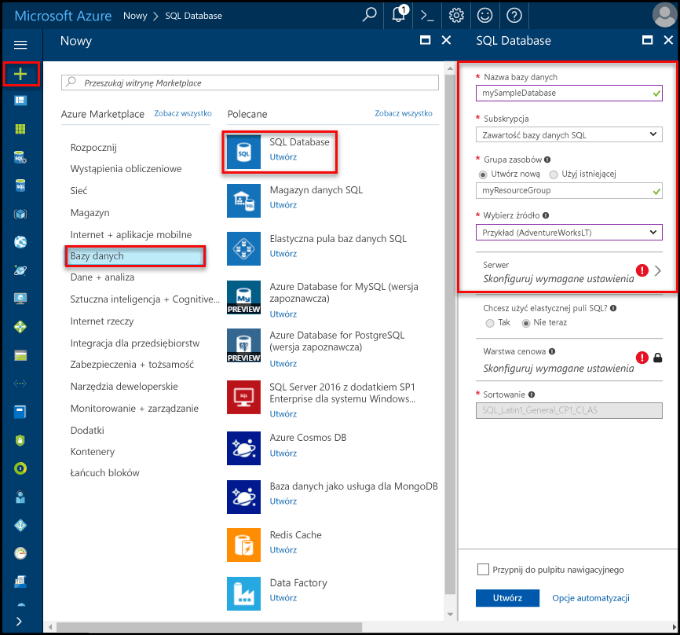

# Utwórz i Zarządzaj serwerami bazy danych SQL Azure i baz danychCreate and manage Azure SQL Database servers and databases

Baza danych Azure SQL jest zarządzany bazy danych w systemie Microsoft Azure, która jest tworzona w [grupy zasobów platformy Azure](../azure-resource-manager/resource-group-overview.md) ze zdefiniowanym zestawem [zasobów obliczeniowych i magazynu dla różnych obciążeń](sql-database-service-tiers.md).An Azure SQL database is a managed database in Microsoft Azure that is created within an [Azure resource group](../azure-resource-manager/resource-group-overview.md) with a defined set of [compute and storage resources for different workloads](sql-database-service-tiers.md). Baza danych Azure SQL jest skojarzony z serwera logicznego bazy danych SQL Azure, który jest tworzony w określonym regionie Azure.An Azure SQL database is associated with an Azure SQL Database logical server, which is created within a specific Azure region. 

## Baza danych Azure SQL mogą być jednej puli i podzielonym na partycje bazy danychAn Azure SQL database can be a single, pooled, or partitioned database

Baza danych Azure SQL mogą być:An Azure SQL database can be:

- pojedynczą bazą danych z [własnym zestawem zasobów](sql-database-what-is-a-dtu.md#what-are-database-transaction-units-dtus) (jednostki DTU).A single database with its [own set of resources](sql-database-what-is-a-dtu.md#what-are-database-transaction-units-dtus) (DTUs)
- Część [puli elastycznej SQL](sql-database-elastic-pool.md) który [udostępnia zestaw zasobów](sql-database-what-is-a-dtu.md#what-are-elastic-database-transaction-units-edtus) (Edtu)Part of a [SQL elastic pool](sql-database-elastic-pool.md) that [shares a set of resources](sql-database-what-is-a-dtu.md#what-are-elastic-database-transaction-units-edtus) (eDTUs)
- częścią [skalowanego zestawu baz danych podzielonych na fragmenty](sql-database-elastic-scale-introduction.md#horizontal-and-vertical-scaling), które mogą być pojedynczymi bazami danych lub pulami baz danych.Part of a [scaled-out set of sharded databases](sql-database-elastic-scale-introduction.md#horizontal-and-vertical-scaling), which can be either single or pooled databases
- częścią zestawu baz danych uczestniczącego we [wzorcu projektowym wielodostępnych aplikacji SaaS](sql-database-design-patterns-multi-tenancy-saas-applications.md), którego bazy danych mogą być pojedynczymi bazami danych i/lub pulami baz danych.Part of a set of databases participating in a [multitenant SaaS design pattern](sql-database-design-patterns-multi-tenancy-saas-applications.md), and whose databases can either be single or pooled databases (or both) 

> [!TIP]
> Prawidłowe nazwy baz danych opisano w artykule [Database Identifiers](https://docs.microsoft.com/en-us/sql/relational-databases/databases/database-identifiers) (Identyfikatory baz danych).For valid database names, see [Database Identifiers](https://docs.microsoft.com/en-us/sql/relational-databases/databases/database-identifiers). 
>
 
- Domyślnym sortowaniem baz danych używanym przez usługę Microsoft Azure SQL Database jest sortowanie **SQL_LATIN1_GENERAL_CP1_CI_AS**, gdzie **LATIN1_GENERAL** oznacza język angielski (Stany Zjednoczone), **CP1** oznacza stronę kodową 1252, **CI** oznacza uwzględnianie wielkości liter, a **AS** oznacza uwzględnianie akcentów.The default database collation used by Microsoft Azure SQL Database is **SQL_LATIN1_GENERAL_CP1_CI_AS**, where **LATIN1_GENERAL** is English (United States), **CP1** is code page 1252, **CI** is case-insensitive, and **AS** is accent-sensitive. Aby uzyskać więcej informacji na temat sposobu ustawiania sortowania, zobacz instrukcję [COLLATE (Transact-SQL)](https://msdn.microsoft.com/library/ms184391.aspx).For more information about how to set the collation, see [COLLATE (Transact-SQL)](https://msdn.microsoft.com/library/ms184391.aspx).
- Baza danych SQL Azure Microsoft obsługuje danych tabelarycznych (TDS) protokół klienta wersja strumienia 7.3 lub nowszej.Microsoft Azure SQL Database supports tabular data stream (TDS) protocol client version 7.3 or later.
- Dozwolone są tylko połączenia protokołu TCP/IP.Only TCP/IP connections are allowed.

## Co to jest serwer logiczny Azure SQL?What is an Azure SQL logical server?

Serwer logiczny działa jako centralny punkt administracyjny dla wielu baz danych, w tym [puli elastycznej SQL](sql-database-elastic-pool.md) [logowania](sql-database-manage-logins.md), [reguły zapory](sql-database-firewall-configure.md), [inspekcji reguły](sql-database-auditing.md), [zasady wykrywania zagrożeń](sql-database-threat-detection.md), i [trybu failover grupy](sql-database-geo-replication-overview.md).A logical server acts as a central administrative point for multiple databases, including [SQL elastic pools](sql-database-elastic-pool.md) [logins](sql-database-manage-logins.md), [firewall rules](sql-database-firewall-configure.md), [auditing rules](sql-database-auditing.md), [threat detection policies](sql-database-threat-detection.md), and [failover groups](sql-database-geo-replication-overview.md). W regionie innym niż jego grupa zasobów może być serwerem logicznym.A logical server can be in a different region than its resource group. Serwer logiczny musi istnieć przed przystąpieniem do tworzenia bazy danych Azure SQL.The logical server must exist before you can create the Azure SQL database. Wszystkie bazy danych na serwerze są tworzone w tym samym regionie co serwer logiczny.All databases on a server are created within the same region as the logical server. 

> [!IMPORTANT]
> W usłudze SQL Database serwer jest konstrukcją logiczną, inną niż wystąpienie programu SQL Server, z którym można zapoznać się w środowisku lokalnym.In SQL Database, a server is a logical construct that is distinct from a SQL Server instance that you may be familiar with in the on-premises world. W szczególności usługa SQL Database nie udziela żadnych gwarancji dotyczących lokalizacji baz danych w odniesieniu do ich serwerów logicznych i nie uwidacznia dostępu ani żadnych funkcji na poziomie wystąpienia.Specifically, the SQL Database service makes no guarantees regarding location of the databases in relation to their logical servers, and exposes no instance-level access or features.
> 

Tworzenie serwera logicznego, należy podać serwer, konto logowania i hasło, które ma prawa administracyjne do głównej bazy danych na tym serwerze i wszystkich baz danych utworzonych na tym serwerze.When you create a logical server, you provide a server login account and password that has administrative rights to the master database on that server and all databases created on that server. To konto początkowej jest konto logowania SQL.This initial account is a SQL login account. Baza danych SQL Azure obsługuje uwierzytelnianie SQL i uwierzytelniania usługi Azure Active Directory do uwierzytelniania.Azure SQL Database supports SQL authentication and Azure Active Directory Authentication for authentication. Aby uzyskać informacje dotyczące logowania i uwierzytelniania, zobacz [Zarządzanie bazami danych i Logowaniami w bazie danych SQL Azure](sql-database-manage-logins.md).For information about logins and authentication, see [Managing Databases and Logins in Azure SQL Database](sql-database-manage-logins.md). Uwierzytelnianie systemu Windows nie jest obsługiwane.Windows Authentication is not supported. 

> [!TIP]
> Aby uzyskać prawidłowy zasób grupy i nazw serwerów, zobacz [nazewnictwa reguły i ograniczenia](https://docs.microsoft.com/azure/architecture/best-practices/naming-conventions).For valid resource group and server names, see [Naming rules and restrictions](https://docs.microsoft.com/azure/architecture/best-practices/naming-conventions).
>

Serwer logiczny bazy danych Azure:An Azure Database logical server:

- Jest tworzony w ramach subskrypcji platformy Azure, ale można go przenieść wraz z zawartymi w nim zasobami do innej subskrypcjiIs created within an Azure subscription, but can be moved with its contained resources to another subscription
- Jest zasobem nadrzędnym dla baz danych, pul elastycznych i magazynów danychIs the parent resource for databases, elastic pools, and data warehouses
- Obejmuje przestrzeń nazw dla bazy danych, pule elastyczne i magazyny danychProvides a namespace for databases, elastic pools, and data warehouses
- Jest kontenerem logicznym z semantyki silne istnienia — usuwanie serwera i usuwa zawartych baz danych, pule elastyczne i magazyny danychIs a logical container with strong lifetime semantics - delete a server and it deletes the contained databases, elastic pools, and data warehouses
- Uczestniczy w [kontroli dostępu opartej na rolach na platformie Azure (RBAC)](/active-directory/role-based-access-control-what-is) -baz danych, pule elastyczne i hurtowni danych w ramach serwera dziedziczą prawa dostępu z serweraParticipates in [Azure role-based access control (RBAC)](/active-directory/role-based-access-control-what-is) - databases, elastic pools, and data warehouses within a server inherit access rights from the server
- Jest elementem znaczących tożsamości baz danych, pule elastyczne i magazynów danych dla zasobów platformy Azure (Zobacz Schemat adresu URL dla baz danych i pul) do celów zarządzaniaIs a high-order element of the identity of databases, elastic pools, and data warehouses for Azure resource management purposes (see the URL scheme for databases and pools)
- Rozmieszcza zasoby w regionieCollocates resources in a region
- Udostępnia punkt końcowy połączenia dla dostępu do baz danych (<serverName>.database.windows.net)Provides a connection endpoint for database access (<serverName>.database.windows.net)
- Zapewnia dostęp do metadanych dotyczących zawartych zasobów przy użyciu dynamicznych widoków zarządzania, łącząc się z główną bazą danychProvides access to metadata regarding contained resources via DMVs by connecting to a master database 
- Określa zakres dla zasad zarządzania, które dotyczą bazy danych — logowania, zapory, inspekcji, zagrożenia wykrywania itp.Provides the scope for management policies that apply to its databases - logins, firewall, audit, threat detection, etc. 
- Jest ograniczony przez przydział w ramach subskrypcji nadrzędnej (sześciu serwerów na subskrypcję domyślnie - [Zobacz subskrypcji w tym miejscu ogranicza](../azure-subscription-service-limits.md))Is restricted by a quota within the parent subscription (six servers per subscription by default - [see Subscription limits here](../azure-subscription-service-limits.md))
- Udostępnia zakres limit przydziału bazy danych i limit przydziału jednostek DTU dla zasoby, które zawiera (na przykład DTU 45 000)Provides the scope for database quota and DTU quota for the resources it contains (such as 45,000 DTU)
- Zakres przechowywania wersji dla możliwościami włączonymi na zasobach ograniczonegoIs the versioning scope for capabilities enabled on contained resources 
- Logowania główne na poziomie serwera mogą zarządzać wszystkimi bazami danych na serwerzeServer-level principal logins can manage all databases on a server
- Może zawierać logowania podobne do tych w lokalnych wystąpieniach programu SQL Server, którym udzielono dostępu do co najmniej jednej bazy danych na serwerze, i może otrzymać ograniczone prawa administracyjne.Can contain logins similar to those in instances of SQL Server on your premises that are granted access to one or more databases on the server, and can be granted limited administrative rights. Aby uzyskać więcej informacji, zobacz temat [Logowania](sql-database-manage-logins.md).For more information, see [Logins](sql-database-manage-logins.md).

## Chronione przez zaporę bazy danych SQL Azure bazy danych SQLAzure SQL databases protected by SQL Database firewall

Aby ułatwić ochronę danych, [zapory bazy danych SQL](sql-database-firewall-configure.md) uniemożliwia dostęp do serwera bazy danych lub dowolny z jej baz danych z poza połączenie z serwerem bezpośrednio za pośrednictwem połączenia subskrypcji platformy Azure.To help protect your data, a [SQL Database firewall](sql-database-firewall-configure.md) prevents all access to your database server or any of its databases from outside of your connection to the server directly through your Azure subscription connection. Aby włączyć dodatkowe łączności, należy najpierw [utworzyć co najmniej jedną regułę zapory](sql-database-firewall-configure.md#creating-and-managing-firewall-rules).To enable additional connectivity, you must [create one or more firewall rules](sql-database-firewall-configure.md#creating-and-managing-firewall-rules). Do tworzenia i zarządzania pule elastyczne SQL, zobacz [pule elastyczne](sql-database-elastic-pool.md).For creating and managing SQL elastic pools, see [Elastic pools](sql-database-elastic-pool.md).

## Zarządzaj serwerami oraz baz danych Azure SQL a zapory przy użyciu portalu AzureManage Azure SQL servers, databases, and firewalls using the Azure portal

Można utworzyć grupy zasobów bazy danych Azure SQL wcześniejsze lub podczas tworzenia serwera.You can create the Azure SQL database's resource group ahead of time or while creating the server itself. Istnieje wiele metod pobierania do nowego formularza serwera SQL, tworząc nowy serwer SQL lub podczas tworzenia nowej bazy danych.There are multiple methods for getting to a new SQL server form, either by creating a new SQL server or as part of creating a new database. 

### Utwórz puste SQL server (serwer logiczny)Create a blank SQL server (logical server)

Do utworzenia serwera (bez bazy danych) bazy danych SQL Azure przy użyciu [portalu Azure](https://portal.azure.com), przejdź do pustego formularza programu SQL server (serwer logiczny).To create an Azure SQL Database server (without a database) using the [Azure portal](https://portal.azure.com), navigate to a blank SQL server (logical server) form. Poniższy zrzut ekranu przedstawia jedną metodę otwierania formularz, aby utworzyć pusty serwer logiczny SQL.The following screenshot shows one method for opening a form to create a blank logical SQL server. 

   

Jeśli do tego formularza za pomocą innej metody, informacje w formularzu są identyczne.If you get to this form using another method, the information on the form is identical.

### Utwórz puste lub przykładowa baza danych SQLCreate a blank or sample SQL database

Do utworzenia bazy danych Azure SQL przy użyciu [portalu Azure](https://portal.azure.com), przejdź do pusty formularz bazy danych SQL i podaj żądane informacje.To create an Azure SQL database using the [Azure portal](https://portal.azure.com), navigate to a blank SQL Database form and provide the requested information. Można utworzyć grupy zasobów i serwer logiczny wcześniejsze lub podczas tworzenia bazy danych bazy danych Azure SQL.You can create the Azure SQL database's resource group and logical server ahead of time or while creating the database itself. Można utworzyć pustą bazę danych lub utworzyć oparty na Adventure Works LT. przykładowej bazy danychYou can create a blank database or create a sample database based on Adventure Works LT. 

  

> [WAŻNE] Aby uzyskać informacje dotyczące wybierania warstwy cenowej bazy danych, zobacz [warstw usług](sql-database-service-tiers.md).[IMPORTANT] For information on selecting the pricing tier for your database, see [Service tiers](sql-database-service-tiers.md).
>

### Zarządzanie istniejącego serwera SQLManage an existing SQL server

Aby zarządzać istniejącego serwera, przejdź do serwera przy użyciu metod — przykład wyświetlanie określonej strony bazy danych SQL, **serwerów SQL** strony, lub **wszystkie zasoby** strony.To manage an existing server, navigate to the server using a number of methods - such as from specific SQL database page, the **SQL servers** page, or the **All resources** page. Poniższy zrzut ekranu pokazuje, jak rozpocząć, ustawienia zapory poziomu serwera z **omówienie** strony serwera.The following screenshot shows how to begin setting a server-level firewall from the **Overview** page for a server. 

   

Do zarządzania istniejącą bazę danych, przejdź do **baz danych SQL** i kliknij przycisk bazy danych chcesz zarządzać.To manage an existing database, navigate to the **SQL databases** page and click the database you wish to manage. Poniższy zrzut ekranu pokazuje, jak rozpocząć, ustawienia zapory poziomu serwera bazy danych z **omówienie** stron dla bazy danych.The following screenshot shows how to begin setting a server-level firewall for a database from the **Overview** page for a database. 

    

> [!IMPORTANT]
> Aby skonfigurować właściwości wydajności bazy danych, zobacz [warstw usług](sql-database-service-tiers.md).To configure performance properties for a database, see [Service tiers](sql-database-service-tiers.md).
>

> [!TIP]
> Samouczek szybki start dla usługi Azure portalu, zobacz [tworzenie bazy danych Azure SQL w portalu Azure](sql-database-get-started-portal.md).For an Azure portal quick start tutorial, see [Create an Azure SQL database in the Azure portal](sql-database-get-started-portal.md).
>

## Zarządzaj serwerami oraz baz danych Azure SQL a zapory przy użyciu programu PowerShellManage Azure SQL servers, databases, and firewalls using PowerShell

Tworzenie i zarządzanie nimi Azure SQL server, baz danych i zapory przy użyciu programu Azure PowerShell, użyj następujących poleceń cmdlet programu PowerShell.To create and manage Azure SQL server, databases, and firewalls with Azure PowerShell, use the following PowerShell cmdlets. Jeśli musisz zainstalować lub uaktualnić programu PowerShell, zobacz [modułu instalacji programu Azure PowerShell](/powershell/azure/install-azurerm-ps).If you need to install or upgrade PowerShell, see [Install Azure PowerShell module](/powershell/azure/install-azurerm-ps). Do tworzenia i zarządzania pule elastyczne SQL, zobacz [pule elastyczne](sql-database-elastic-pool.md).For creating and managing SQL elastic pools, see [Elastic pools](sql-database-elastic-pool.md).

| Polecenie cmdletCmdlet | OpisDescription |
| --- | --- |
|[New-AzureRmSqlDatabaseNew-AzureRmSqlDatabase](/powershell/module/azurerm.sql/new-azurermsqldatabase)|Tworzy bazę danychCreates a database |
|[Get-AzureRmSqlDatabaseGet-AzureRmSqlDatabase](/powershell/module/azurerm.sql/get-azurermsqldatabase)|Pobiera jeden lub więcej baz danychGets one or more databases|
|[Set-AzureRmSqlDatabaseSet-AzureRmSqlDatabase](/powershell/module/azurerm.sql/set-azurermsqldatabase)|Ustawia właściwości dla bazy danych lub przenosi istniejącą bazę danych do puli elastycznejSets properties for a database, or moves an existing database into an elastic pool|
|[Remove-AzureRmSqlDatabaseRemove-AzureRmSqlDatabase](/powershell/module/azurerm.sql/remove-azurermsqldatabase)|Usuwa z bazy danychRemoves a database|
|[Nowe AzureRmResourceGroupNew-AzureRmResourceGroup](/powershell/module/azurerm.resources/new-azurermresourcegroup)|Tworzy grupę zasobów]Creates a resource group]
|[Nowe AzureRmSqlServerNew-AzureRmSqlServer](/powershell/module/azurerm.sql/new-azurermsqlserver)|Tworzy serwerCreates a  server|
|[Get-AzureRmSqlServerGet-AzureRmSqlServer](/powershell/module/azurerm.sql/get-azurermsqlserver)|Zwraca informacje na temat serwerówReturns information about servers|
|[Set-AzureRmSqlServerSet-AzureRmSqlServer](https://docs.microsoft.com/en-us/powershell/module/azurerm.sql/set-azurermsqlserver)|Modyfikuje właściwości serweraModifies properties of a server|
|[Remove-AzureRmSqlServerRemove-AzureRmSqlServer](/powershell/module/azurerm.sql/remove-azurermsqlserver)|Usuwa serwerRemoves a server|
|[New-AzureRmSqlServerFirewallRuleNew-AzureRmSqlServerFirewallRule](/powershell/module/azurerm.sql/new-azurermsqlserverfirewallrule)|Tworzy regułę zapory poziomu serweraCreates a server-level firewall rule |
|[Get-AzureRmSqlServerFirewallRuleGet-AzureRmSqlServerFirewallRule](/powershell/module/azurerm.sql/get-azurermsqlserverfirewallrule)|Pobiera reguły zapory serweraGets firewall rules for a server|
|[Set-AzureRmSqlServerFirewallRuleSet-AzureRmSqlServerFirewallRule](/powershell/module/azurerm.sql/set-azurermsqlserverfirewallrule)|Modyfikuje regułę zapory na serwerzeModifies a firewall rule in a server|
|[Remove-AzureRmSqlServerFirewallRuleRemove-AzureRmSqlServerFirewallRule](/powershell/module/azurerm.sql/remove-azurermsqlserverfirewallrule)|Usuwa regułę zapory z serwera.Deletes a firewall rule from a server.|

> [!TIP]
> Samouczek szybki start programu PowerShell, zobacz [tworzenia pojedynczej bazy danych Azure SQL przy użyciu programu PowerShell](sql-database-get-started-portal.md).For a PowerShell quick start tutorial, see [Create a single Azure SQL database using PowerShell](sql-database-get-started-portal.md). Dla programu PowerShell przykładowe skrypty, zobacz [Użyj programu PowerShell do tworzenia pojedynczej bazy danych Azure SQL i skonfigurować regułę zapory](scripts/sql-database-create-and-configure-database-powershell.md) i [monitora i skali pojedynczego SQL bazy danych przy użyciu programu PowerShell](scripts/sql-database-monitor-and-scale-database-powershell.md).For PowerShell example scripts, see [Use PowerShell to create a single Azure SQL database and configure a firewall rule](scripts/sql-database-create-and-configure-database-powershell.md) and [Monitor and scale a single SQL database using PowerShell](scripts/sql-database-monitor-and-scale-database-powershell.md).
>

## Zarządzaj serwerami oraz baz danych Azure SQL a zapory przy użyciu wiersza polecenia platformy AzureManage Azure SQL servers, databases, and firewalls using the Azure CLI

Tworzenie i zarządzanie nimi Azure SQL server, baz danych i zapory z [interfejsu wiersza polecenia Azure](/cli/azure/overview), należy użyć następującego [bazy danych SQL interfejsu wiersza polecenia Azure](/cli/azure/sql/db) poleceń.To create and manage Azure SQL server, databases, and firewalls with the [Azure CLI](/cli/azure/overview), use the following [Azure CLI SQL Database](/cli/azure/sql/db) commands. Używaj usługi [Cloud Shell](/azure/cloud-shell/overview), aby uruchamiać interfejs wiersza polecenia w przeglądarce, albo [zainstaluj](/cli/azure/install-azure-cli) go w systemie macOS, Linux lub Windows.Use the [Cloud Shell](/azure/cloud-shell/overview) to run the CLI in your browser, or [install](/cli/azure/install-azure-cli) it on macOS, Linux, or Windows. Do tworzenia i zarządzania pule elastyczne SQL, zobacz [pule elastyczne](sql-database-elastic-pool.md).For creating and managing SQL elastic pools, see [Elastic pools](sql-database-elastic-pool.md).

| Polecenie cmdletCmdlet | OpisDescription |
| --- | --- |
|[Tworzenie bazy danych sql azaz sql db create](/cli/azure/sql/db#create) |Tworzy bazę danychCreates a database|
|[Lista bazy danych sql azaz sql db list](/cli/azure/sql/db#list)|Wyświetla listę wszystkich baz danych i magazynów danych na serwerze lub wszystkie bazy danych w puli elastycznejLists all databases and data warehouses in a server, or all databases in an elastic pool|
|[Lista wersje az bazy danych sqlaz sql db list-editions](/cli/azure/sql/db#list-editions)|Wyświetla dostępne usługi cele i limity magazynuLists available service objectives and storage limits|
|[bazy danych sql az listy użyciaaz sql db list-usages](/cli/azure/sql/db#list-usages)|Zwraca bazy danych użyciaReturns database usages|
|[Pokaż bazy danych sql azaz sql db show](/cli/azure/sql/db#show)|Pobiera Magazyn bazy danych lub danychGets a database or data warehouse|
|[Aktualizacja bazy danych sql azaz sql db update](/cli/azure/sql/db#update)|Aktualizuje bazę danychUpdates a database|
|[Usuwanie bazy danych sql azaz sql db delete](/cli/azure/sql/db#delete)|Usuwa z bazy danychRemoves a database|
|[Tworzenie grupy azaz group create](/cli/azure/group#create)|Tworzy grupę zasobówCreates a resource group|
|[Utwórz az programu sql serveraz sql server create](/cli/azure/sql/server#create)|Tworzy serwerCreates a server|
|[Lista serwerów sql azaz sql server list](/cli/azure/sql/server#list)|Wyświetla serweryLists servers|
|[Serwer sql az listy użyciaaz sql server list-usages](/cli/azure/sql/server#list-usages)|Zwraca użycia serweraReturns  server usages|
|[Pokaż serwera sql azaz sql server show](/cli/azure/sql/server#show)|Pobiera serweraGets a server|
|[Aktualizacja programu sql server azaz sql server update](/cli/azure/sql/server#update)|Serwer aktualizacjiUpdates a server|
|[Usuń serwer sql azaz sql server delete](/cli/azure/sql/server#delete)|Usuwa serwerDeletes a server|
|[Utwórz az programu sql server — reguły zaporyaz sql server firewall-rule create](/cli/azure/sql/server/firewall-rule#create)|Powoduje utworzenie reguły zapory serweraCreates a server firewall rule|
|[Lista reguł zapory serwera sql azaz sql server firewall-rule list](/cli/azure/sql/server/firewall-rule#list)|Wyświetla listę reguł zapory na serwerzeLists the firewall rules on a server|
|[Pokaż reguły zapory serwera sql azaz sql server firewall-rule show](/cli/azure/sql/server/firewall-rule#show)|Wyświetla szczegóły reguły zaporyShows the detail of a firewall rule|
|[Aktualizacja reguły zapory programu sql server azaz sql server firewall-rule update](/cli/azure/sql/server/firewall-rule#update)|Aktualizuje regułę zaporyUpdates a firewall rule|
|[Usuwanie reguły zapory serwera sql azaz sql server firewall-rule delete](/cli/azure/sql/server/firewall-rule#delete)|Usuwa regułę zaporyDeletes a firewall rule|

> [!TIP]
> Samouczek szybki start wiersza polecenia platformy Azure, zobacz [tworzenia pojedynczej bazy danych Azure SQL przy użyciu interfejsu wiersza polecenia Azure](sql-database-get-started-cli.md).For an Azure CLI quick start tutorial, see [Create a single Azure SQL database using the Azure CLI](sql-database-get-started-cli.md). Dla interfejsu wiersza polecenia Azure przykładowe skrypty, zobacz [Użyj interfejsu wiersza polecenia do tworzenia pojedynczej bazy danych Azure SQL i skonfigurować regułę zapory](scripts/sql-database-create-and-configure-database-cli.md) i [Użyj interfejsu wiersza polecenia, aby monitorować i skalowania pojedynczej bazy danych SQL](scripts/sql-database-monitor-and-scale-database-cli.md).For Azure CLI example scripts, see [Use CLI to create a single Azure SQL database and configure a firewall rule](scripts/sql-database-create-and-configure-database-cli.md) and [Use CLI to monitor and scale a single SQL database](scripts/sql-database-monitor-and-scale-database-cli.md).
>

## Zarządzaj serwerami oraz baz danych Azure SQL a zapory przy użyciu języka Transact-SQLManage Azure SQL servers, databases, and firewalls using Transact-SQL

Tworzenie i zarządzanie nimi Azure SQL server, baz danych i zapór z Transact-SQL, użyj następujących poleceń T-SQL.To create and manage Azure SQL server, databases, and firewalls with Transact-SQL, use the following T-SQL commands. Te polecenia przy użyciu portalu Azure może wystawiać [programu SQL Server Management Studio](/sql/ssms/use-sql-server-management-studio), [Visual Studio Code](https://code.visualstudio.com/docs), lub inny program, który może nawiązywać połączenia z serwerem bazy danych SQL Azure i przekazać języka Transact-SQL polecenia.You can issue these commands using the Azure portal, [SQL Server Management Studio](/sql/ssms/use-sql-server-management-studio), [Visual Studio Code](https://code.visualstudio.com/docs), or any other program that can connect to an Azure SQL Database server and pass Transact-SQL commands. Do zarządzania pule elastyczne SQL, zobacz [pule elastyczne](sql-database-elastic-pool.md).For managing SQL elastic pools, see [Elastic pools](sql-database-elastic-pool.md).

> [!IMPORTANT]
> Nie można utworzyć ani usunąć z serwerem przy użyciu języka Transact-SQL.You cannot create or delete a server using Transact-SQL.
>

| PolecenieCommand | OpisDescription |
| --- | --- |
|[Utwórz bazę danych (baza danych Azure SQL)CREATE DATABASE (Azure SQL Database)](/sql/t-sql/statements/create-database-azure-sql-database)|Tworzy nową bazę danych.Creates a new database. Musisz mieć połączenie z główną bazą danych, aby utworzyć nową bazę danych.You must be connected to the master database to create a new database.|
| [ALTER DATABASE (baza danych Azure SQL)ALTER DATABASE (Azure SQL Database)](/sql/t-sql/statements/alter-database-azure-sql-database) |Modyfikuje bazy danych Azure SQL.Modifies an Azure SQL database. |
|[ALTER DATABASE (Azure SQL Data Warehouse)ALTER DATABASE (Azure SQL Data Warehouse)](/sql/t-sql/statements/alter-database-azure-sql-data-warehouse)|Modyfikuje magazyn danych Azure SQL.Modifies an Azure SQL Data Warehouse.|
|[Usuwanie bazy danych (Transact-SQL)DROP DATABASE (Transact-SQL)](/sql/t-sql/statements/drop-database-transact-sql)|Usuwa z bazy danych.Deletes a database.|
|[sys.database_service_objectives (baza danych SQL Azure)sys.database_service_objectives (Azure SQL Database)](/sql/relational-databases/system-catalog-views/sys-database-service-objectives-azure-sql-database)|Zwraca edition (warstwy usług), celem usługi (warstwa cenowa) i nazwę puli elastycznej dla bazy danych Azure SQL lub usługi Azure SQL Data Warehouse.Returns the edition (service tier), service objective (pricing tier), and elastic pool name, if any, for an Azure SQL database or an Azure SQL Data Warehouse. Jeśli zalogowany do głównej bazy danych na serwerze bazy danych SQL Azure, zwraca informacje o wszystkich baz danych.If logged on to the master database in an Azure SQL Database server, returns information on all databases. Dla usługi Azure SQL Data Warehouse musi być podłączony do bazy danych master.For Azure SQL Data Warehouse, you must be connected to the master database.|
|[sys.dm_db_resource_stats (baza danych SQL Azure)sys.dm_db_resource_stats (Azure SQL Database)](/sql/relational-databases/system-dynamic-management-views/sys-dm-db-resource-stats-azure-sql-database)| Zwraca zużycie Procesora, operacji We/Wy i pamięci dla bazy danych z bazy danych SQL Azure.Returns CPU, I/O, and memory consumption for an Azure SQL Database database. Dla co 15 s istnieje jeden wiersz, nawet jeśli nic się nie w bazie danych.One row exists for every 15 seconds, even if there is no activity in the database.|
|[sys.resource_stats (baza danych SQL Azure)sys.resource_stats (Azure SQL Database)](/sql/relational-databases/system-catalog-views/sys-resource-stats-azure-sql-database)|Zwraca procesora CPU, użycia i magazynu danych dla bazy danych SQL Azure.Returns CPU usage and storage data for an Azure SQL Database. Dane są zbierane i agregowane w ciągu 5 minut.The data is collected and aggregated within five-minute intervals.|
|[sys.database_connection_stats (baza danych SQL Azure)sys.database_connection_stats (Azure SQL Database)](/sql/relational-databases/system-catalog-views/sys-database-connection-stats-azure-sql-database)|Zawiera dane statystyczne dla zdarzenia łączności bazy danych SQL Database przedstawiające przegląd bazy danych połączenia sukcesy i niepowodzenia.Contains statistics for SQL Database database connectivity events, providing an overview of database connection successes and failures. |
|[sys.event_log (baza danych SQL Azure)sys.event_log (Azure SQL Database)](/sql/relational-databases/system-catalog-views/sys-event-log-azure-sql-database)|Zwraca pomyślnego połączenia z bazą danych usługi Azure SQL Database, błędy połączeń i zakleszczenia.Returns successful Azure SQL Database database connections, connection failures, and deadlocks. Te informacje można użyć do śledzenia i rozwiązywanie problemów z działania bazy danych z bazy danych SQL.You can use this information to track or troubleshoot your database activity with SQL Database.|
|[procedurę składowaną sp_set_firewall_rule (baza danych SQL Azure)sp_set_firewall_rule (Azure SQL Database)](/sql/relational-databases/system-stored-procedures/sp-set-firewall-rule-azure-sql-database)|Tworzy lub aktualizuje ustawienia zapory poziomu serwera dla serwera bazy danych SQL.Creates or updates the server-level firewall settings for your SQL Database server. Ta procedura składowana jest dostępna tylko w bazie danych master do głównego identyfikatora logowania poziomu serwera.This stored procedure is only available in the master database to the server-level principal login. Reguły zapory poziomu serwera można tworzyć tylko za pomocą języka Transact-SQL, po utworzeniu pierwszej reguły zapory poziomu serwera przez użytkownika z uprawnienia na poziomie AzureA server-level firewall rule can only be created using Transact-SQL after the first server-level firewall rule has been created by a user with Azure-level permissions|
|[sys.firewall_rules (baza danych SQL Azure)sys.firewall_rules (Azure SQL Database)](/sql/relational-databases/system-catalog-views/sys-firewall-rules-azure-sql-database)|Zwraca informacje na temat ustawień zapory na poziomie serwera, skojarzonych z bazy danych SQL Microsoft Azure.Returns information about the server-level firewall settings associated with your Microsoft Azure SQL Database.|
|[sp_delete_firewall_rule (baza danych SQL Azure)sp_delete_firewall_rule (Azure SQL Database)](/sql/relational-databases/system-stored-procedures/sp-delete-firewall-rule-azure-sql-database)|Usuwa ustawienia zapory poziomu serwera z serwerem bazy danych SQL.Removes server-level firewall settings from your SQL Database server. Ta procedura składowana jest dostępna tylko w bazie danych master do głównego identyfikatora logowania poziomu serwera.This stored procedure is only available in the master database to the server-level principal login.|
|[sp_set_database_firewall_rule (baza danych SQL Azure)sp_set_database_firewall_rule (Azure SQL Database)](/sql/relational-databases/system-stored-procedures/sp-set-database-firewall-rule-azure-sql-database)|Tworzy lub aktualizuje reguły zapory poziomu bazy danych dla bazy danych SQL Azure lub usługi SQL Data Warehouse.Creates or updates the database-level firewall rules for your Azure SQL Database or SQL Data Warehouse. Można skonfigurować reguł zapory bazy danych dla bazy danych master i baz danych użytkowników w bazie danych SQL.Database firewall rules can be configured for the master database, and for user databases on SQL Database. Reguły zapory bazy danych są przydatne, gdy przy użyciu zawarte bazy danych użytkowników.Database firewall rules are useful when using contained database users. |
|[sys.database_firewall_rules (baza danych SQL Azure)sys.database_firewall_rules (Azure SQL Database)](/sql/relational-databases/system-catalog-views/sys-database-firewall-rules-azure-sql-database)|Zwraca informacje na temat ustawień zapory na poziomie bazy danych, skojarzonych z bazy danych SQL Microsoft Azure.Returns information about the database-level firewall settings associated with your Microsoft Azure SQL Database. |
|[sp_delete_database_firewall_rule (baza danych SQL Azure)sp_delete_database_firewall_rule (Azure SQL Database)](/sql/relational-databases/system-stored-procedures/sp-delete-database-firewall-rule-azure-sql-database)|Ustawienia zapory na poziomie bazy danych usuwa z bazy danych SQL Azure lub SQL Data Warehouse.Removes database-level firewall setting from your Azure SQL Database or SQL Data Warehouse. |

> [!TIP]
> Samouczek szybki start Microsoft Windows za pomocą programu SQL Server Management Studio, zobacz [bazy danych SQL Azure: Użyj SQL Server Management Studio do nawiązywania połączeń i zapytania na danych](sql-database-connect-query-ssms.md).For quick start tutorial using SQL Server Management Studio on Microsoft Windows, see [Azure SQL Database: Use SQL Server Management Studio to connect and query data](sql-database-connect-query-ssms.md). Samouczek szybki start za pomocą programu Visual Studio Code na macOS, Linux lub Windows, temacie [bazy danych SQL Azure: Użyj Visual Studio Code do nawiązywania połączeń i zapytania na danych](sql-database-connect-query-vscode.md).For a quick start tutorial using Visual Studio Code on the macOS, Linux, or Windows, see [Azure SQL Database: Use Visual Studio Code to connect and query data](sql-database-connect-query-vscode.md).

## Zarządzaj serwerami oraz baz danych Azure SQL a zapory przy użyciu interfejsu API RESTManage Azure SQL servers, databases, and firewalls using the REST API

Aby utworzyć i zarządzać Azure SQL server, baz danych i zapory przy użyciu interfejsu API REST, zobacz [interfejsu API REST bazy danych SQL Azure](/rest/api/sql/).To create and manage Azure SQL server, databases, and firewalls using the REST API, see [Azure SQL Database REST API](/rest/api/sql/).

## Następne krokiNext steps

- Informacje na temat puli baz danych przy użyciu puli elastycznej SQL, zobacz [pule elastyczne](sql-database-elastic-pool.md).To learn about pooling databases using SQL elastic pools, see [Elastic pools](sql-database-elastic-pool.md).
- Informacje o usłudze Azure SQL Database, zobacz [co to jest SQL Database?](sql-database-technical-overview.md).For information about the Azure SQL Database service, see [What is SQL Database?](sql-database-technical-overview.md).
- Informacje na temat migracji bazy danych programu SQL Server na platformie Azure, zobacz [migracji do usługi Azure SQL Database](sql-database-cloud-migrate.md).To learn about migrating a SQL Server database to Azure, see [Migrate to Azure SQL Database](sql-database-cloud-migrate.md).
- Informacje dotyczące obsługiwanych funkcji można znaleźć w temacie [Funkcje](sql-database-features.md).For information about supported features, see [Features](sql-database-features.md).
