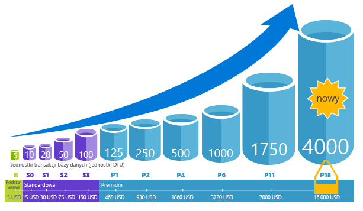
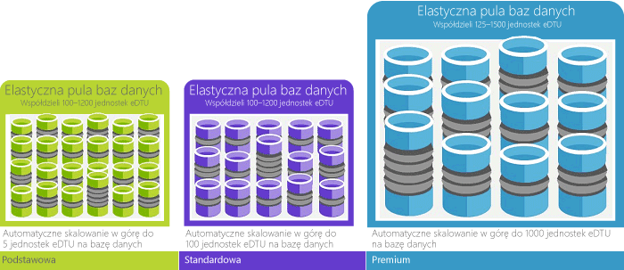

# Co to jest usługa Azure SQL Database hello?What is hello Azure SQL Database service? 

Usługa SQL Database jest usługą relacyjnej bazy danych ogólnego przeznaczenia w systemie Microsoft Azure, obsługującą struktury takie, jak dane relacyjne, JSON, dane przestrzenne i XML.SQL Database is a general-purpose relational database service in Microsoft Azure that supports structures such as relational data, JSON, spatial, and XML. Zapewnia [dynamicznie skalowalną wydajność](sql-database-service-tiers.md) i udostępnia opcje, takie jak [indeksy magazynu kolumn](https://docs.microsoft.com/sql/relational-databases/indexes/columnstore-indexes-overview), używane w skomplikowanych analizach i raportowaniu, oraz [przetwarzanie OLTP danych w pamięci](sql-database-in-memory.md) na potrzeby ekstremalnego przetwarzania transakcyjnego.It delivers [dynamically scalable performance](sql-database-service-tiers.md) and provides options such as [columnstore indexes](https://docs.microsoft.com/sql/relational-databases/indexes/columnstore-indexes-overview) for extreme analytic analysis and reporting, and [in-memory OLTP](sql-database-in-memory.md) for extreme transactional processing. Firma Microsoft obsługuje wszystkie poprawki i uaktualniania kodu SQL hello bezproblemowo i optymalizacji abstracts całe Zarządzanie hello podstawowej infrastruktury.Microsoft handles all patching and updating of hello SQL code base seamlessly and abstracts away all management of hello underlying infrastructure. 

Baza danych SQL udostępnia bazy kodu hello [aparatu bazy danych programu Microsoft SQL Server](https://docs.microsoft.com/sql/sql-server/sql-server-technical-documentation).SQL Database shares its code base with hello [Microsoft SQL Server database engine](https://docs.microsoft.com/sql/sql-server/sql-server-technical-documentation). Ze strategią pierwszy chmury firmy Microsoft hello najnowsze możliwości programu SQL Server są wydanych tooSQL pierwszej bazy danych, a następnie tooSQL sam serwer.With Microsoft's cloud-first strategy, hello newest capabilities of SQL Server are released first tooSQL Database, and then tooSQL Server itself. Takie podejście umożliwia hello najnowsze możliwości programu SQL Server z nie obciążenie poprawki lub uaktualnianie - i z tych nowych funkcji przetestowane przez miliony baz danych.This approach provides you with hello newest SQL Server capabilities with no overhead for patching or upgrading - and with these new features tested across millions of databases. Aby uzyskać informacje dotyczące nowych możliwości w miarę ich publikowania, zobacz:For information about new capabilities as they are announced, see:

- **[Przewodnik po bazy danych SQL Azure](https://azure.microsoft.com/roadmap/?category=databases)**: toofind miejsce nowości i wkrótce dalej.**[Azure Roadmap for SQL Database](https://azure.microsoft.com/roadmap/?category=databases)**: A place toofind out what’s new and what’s coming next. 
- **[Blog usługi Azure SQL Database](https://azure.microsoft.com/blog/topics/database)**: miejsce, w którym członkowie zespołu produktowego programu SQL Server zamieszczają informacje o nowościach i funkcjach usługi SQL Database.**[Azure SQL Database blog](https://azure.microsoft.com/blog/topics/database)**: A place where SQL Server product team members blog about SQL Database news and features. 

Usługa SQL Database oferuje przewidywalną wydajność na różnych poziomach usługi, która zapewnia dynamiczną skalowalność bez przestojów, wbudowany mechanizm inteligentnej optymalizacji, globalną skalowalność i dostępność oraz zaawansowane opcje zabezpieczeń — wszystko przy bliskich zeru nakładach administracyjnych.SQL Database delivers predictable performance at multiple service levels that provides dynamic scalability with no downtime, built-in intelligent optimization, global scalability and availability, and advanced security options — all with near-zero administration. Te funkcje umożliwiają toofocus na tworzenie aplikacji szybki i przyspieszając toomarket Twojego czasu, zamiast przydzielania cenny czas i maszyn wirtualnych toomanaging zasobów i infrastruktury.These capabilities allow you toofocus on rapid app development and accelerating your time toomarket, rather than allocating precious time and resources toomanaging virtual machines and infrastructure. Hello bazy danych SQL, usługa jest obecnie w danych 38 koncentruje się wokół Witaj świecie z więcej centrów danych regularnie, przejście w tryb online, które pozwala toorun bazy danych w centrum danych w pobliżu.hello SQL Database service is currently in 38 data centers around hello world, with more data centers coming online regularly, which enables you toorun your database in a data center near you.

> [!NOTE]
> Aby uzyskać informacje o zabezpieczeniach platformy Azure, zobacz [Centrum zaufania Azure](https://azure.microsoft.com/support/trust-center/security/).See [Azure Trust Center](https://azure.microsoft.com/support/trust-center/security/) for information about Azure's platform security.
>

## Skalowalna wydajność i puleScalable performance and pools

W usłudze SQL Database każda baza danych jest odizolowana od innych i przenośna, z własną [warstwą usług](sql-database-service-tiers.md) i z gwarantowanym poziomem wydajności.With SQL Database, each database is isolated from each other and portable, each with its own [service tier](sql-database-service-tiers.md) with a guaranteed performance level. Baza danych SQL zawiera różne poziomy wydajności dla różnych potrzeb i umożliwia baz danych hello puli toomaximize toobe wykorzystania zasobów i oszczędności.SQL Database provides different performance levels for different needs, and enables databases toobe pooled toomaximize hello use of resources and save money.

### Dostosowanie wydajności i skalowanie bez przestojówAdjust performance and scale without downtime

Baza danych SQL oferuje cztery warstwy usług obciążeń bazy danych lekkie tooheavyweight toosupport: Basic, Standard, Premium i Premium RS.SQL Database offers four service tiers toosupport lightweight tooheavyweight database workloads: Basic, Standard, Premium, and Premium RS. Można utworzyć pierwszą aplikację w bazie danych jednego, mała przy niskich kosztach miesięcznie, a następnie zmień jego warstwy usługi ręcznie lub programowo, na potrzeby hello toomeet czasu dowolnego rozwiązania.You can build your first app on a small, single database at a low cost per month and then change its service tier manually or programmatically at any time toomeet hello needs of your solution. Można dostosować wydajność bez przestojów tooyour aplikacji lub tooyour klientów.You can adjust performance without downtime tooyour app or tooyour customers. Umożliwia dynamiczne skalowalność tootransparently Twojej bazy danych odpowiada toorapidly zmiany wymagań dotyczących zasobów i umożliwia tooonly można płacić za zasoby hello należy najodpowiedniejszym czasie.Dynamic scalability enables your database tootransparently respond toorapidly changing resource requirements and enables you tooonly pay for hello resources that you need when you need them.

   

### Wykorzystanie zasobów toomaximize pul elastycznychElastic pools toomaximize resource utilization

Dla wielu firm i aplikacji jest możliwe toocreate pojedynczych baz danych i wybieranie wydajności w górę lub w dół na żądanie jest wystarczająca, zwłaszcza jeśli wzorce użycia są względnie przewidywalne.For many businesses and applications, being able toocreate single databases and dial performance up or down on demand is enough, especially if usage patterns are relatively predictable. Ale jeśli masz nieprzewidywalnych wzorców, może być twarde toomanage kosztów i modelem biznesowym.But if you have unpredictable usage patterns, it can make it hard toomanage costs and your business model. [Pule elastyczne](sql-database-elastic-pool.md) są zaprojektowane toosolve ten problem.[Elastic pools](sql-database-elastic-pool.md) are designed toosolve this problem. Witaj koncepcja jest prosta.hello concept is simple. Przydziel wydajności zasobów tooa puli, a nie poszczególnych bazy danych i zwrócić hello zasobów łączną wydajność puli hello, a nie dla pojedynczej bazy danych wydajności.You allocate performance resources tooa pool rather than an individual database, and pay for hello collective performance resources of hello pool rather than for single database performance. 

   

Pule elastyczne nie wymagają toofocus na wybierania wydajność bazy danych w górę i w dół, jak zmienia się zapotrzebowania na zasoby.With elastic pools, you don’t need toofocus on dialing database performance up and down as demand for resources fluctuates. Witaj puli baz danych korzystanie z hello wydajności zasobów puli elastycznej hello zgodnie z potrzebami.hello pooled databases consume hello performance resources of hello elastic pool as needed. Korzystać z puli baz danych, ale nie przekraczają limitów puli hello hello, więc koszt pozostaje przewidywalny nawet w przypadku użycia poszczególnych bazy danych nie.Pooled databases consume but don’t exceed hello limits of hello pool, so your cost remains predictable even if individual database usage doesn’t. Ponadto można [Dodawanie i usuwanie baz danych toohello puli](sql-database-elastic-pool-manage-portal.md), skalowanie aplikacji od kilku toothousands baz danych, wszystko w ramach kontrolowanego budżetu.What’s more, you can [add and remove databases toohello pool](sql-database-elastic-pool-manage-portal.md), scaling your app from a handful of databases toothousands, all within a budget that you control. Możesz również minimum hello kontroli i toodatabases dostępne zasoby maksymalna w hello tooensure puli bazy danych w puli hello wykorzystuje wszystkie hello puli zasobów, a w każdej puli bazy danych ma gwarantowane minimalna ilość zasobów.You can also control hello minimum and maximum resources available toodatabases in hello pool tooensure that no database in hello pool uses all hello pool resources and that every pooled database has a guaranteed minimum amount of resources. toolearn więcej informacji na temat wzorców projektowych dla aplikacji SaaS wykorzystujących pule elastyczne, zobacz [wzorce projektowe dla wielodostępnych aplikacji SaaS w usłudze SQL Database](sql-database-design-patterns-multi-tenancy-saas-applications.md).toolearn more about design patterns for SaaS applications using elastic pools, see [Design Patterns for Multi-tenant SaaS Applications with SQL Database](sql-database-design-patterns-multi-tenancy-saas-applications.md).

### Mieszaj pojedyncze bazy danych z bazami danych w puliBlend single databases with pooled databases

W obu przypadkach — pojedyncza baza danych i pule elastyczne — nie ma ograniczenia do jednego rozwiązania.Either way you go — single databases or elastic pools — you are not locked in. Blend pojedyncze bazy danych z puli elastycznej i zmienić hello warstwy usług pojedynczych baz danych i pul elastycznych, szybko i łatwo tooadapt tooyour sytuacji.You can blend single databases with elastic pools, and change hello service tiers of single databases and elastic pools quickly and easily tooadapt tooyour situation. Witaj siły i zasięgu platformy Azure można mieszanego i dopasowania Azure innych usług za pomocą aplikacji unikatowy projektowania potrzeb, dysku kosztów i wydajności zasobów toomeet bazy danych SQL i odblokować nowe możliwości biznesowe.With hello power and reach of Azure, you can mix-and-match other Azure services with SQL Database toomeet your unique app design needs, drive cost and resource efficiencies, and unlock new business opportunities.

### Możliwości rozbudowanego monitorowania i zgłaszania alertówExtensive monitoring and alerting capabilities

Jednak jak porównać względną wydajność pojedynczych baz danych i pul elastycznych hello?But how can you compare hello relative performance of single databases and elastic pools? Skąd wiadomo, powitania kliknij prawym przyciskiem myszy, aby zatrzymać podczas wybierania w górę i w dół?How do you know hello right click-stop when you dial up and down? Użyj hello [monitorowania wydajności wbudowanych](sql-database-performance.md) i [alerty](sql-database-insights-alerts-portal.md) narzędzi, w połączeniu z hello klasyfikacje wydajności na podstawie [jednostki transakcji bazy danych (Dtu) dla pojedynczej bazy danych i elastyczne Dtu (Edtu) dla pul elastycznych](sql-database-what-is-a-dtu.md).You use hello [built-in performance monitoring](sql-database-performance.md) and [alerting](sql-database-insights-alerts-portal.md) tools, combined with hello performance ratings based on [Database Transaction Units (DTUs) for single databases and elastic DTUs (eDTUs) for elastic pools](sql-database-what-is-a-dtu.md). Za pomocą tych narzędzi, można szybko ocenić wpływ hello skalowanie w górę lub w dół na bieżącym podstawie lub projektu na potrzeby w zakresie wydajności.Using these tools, you can quickly assess hello impact of scaling up or down based on your current or project performance needs. Zobacz artykuł [Opcje i wydajność usługi SQL Database: poznaj, co jest dostępne w poszczególnych warstwach usług](sql-database-service-tiers.md), aby uzyskać szczegółowe informacje.See [SQL Database options and performance: Understand what's available in each service tier](sql-database-service-tiers.md) for details.

Ponadto usługa SQL Database może [tworzyć metryki i dzienniki diagnostyczne](sql-database-metrics-diag-logging.md), które ułatwiają monitorowanie.Additionally, SQL Database can [emit metrics and diagnostic logs](sql-database-metrics-diag-logging.md) for easier monitoring. Można skonfigurować użycie zasobów toostore bazy danych SQL, pracowników i sesje i łączności do jednej z tych zasobów platformy Azure:You can configure SQL Database toostore resource usage, workers and sessions, and connectivity into one of these Azure resources:

- **Usługa Azure Storage**: w celu archiwizowania ogromnych ilości danych telemetrycznych za niewielką cenę**Azure Storage**: For archiving vast amounts of telemetry for a small price
- **Centrum zdarzeń Azure**: w celu integracji danych telemetrycznych usługi SQL Database z niestandardowym rozwiązaniem monitorowania lub potokami danych**Azure Event Hub**: For integrating SQL Database telemetry with your custom monitoring solution or hot pipelines
- **Usługa Azure Log Analytics**: w celu użycia wbudowanego rozwiązania monitorowania obejmującego funkcje raportowania, zgłaszania alertów i zmniejszenia ryzyka**Azure Log Analytics**: For built-in monitoring solution with reporting, alerting, and mitigating capabilities

    

## Możliwości dostępnościAvailability capabilities

Umowa dotycząca poziomu usług [(SLA)](http://azure.microsoft.com/support/legal/sla/) o czołowej w branży dostępności 99,99% dla platformy Azure, która jest obsługiwana przez globalną sieć centrów danych zarządzanych przez firmę Microsoft, pomaga zapewnić działanie aplikacji przez 24 godziny na dobę, 7 dni w tygodniu.Azure's industry leading 99.99% availability service level agreement [(SLA)](http://azure.microsoft.com/support/legal/sla/), powered by a global network of Microsoft-managed datacenters, helps keep your app running 24/7. Ponadto usługa SQL Database oferuje wbudowane funkcje [zapewnienia ciągłości działalności biznesowej i globalnej skalowalności](sql-database-business-continuity.md), takie jak:In addition, SQL Database provides built-in [business continuity and global scalability](sql-database-business-continuity.md) features, including:

- **[Automatyczne kopie zapasowe](sql-database-automated-backups.md)**: usługa SQL Database automatycznie wykonuje pełne i różnicowe kopie zapasowe oraz kopie zapasowe dziennika transakcji.**[Automatic backups](sql-database-automated-backups.md)**: SQL Database automatically performs full, differential, and transaction log backups.
- **[W momencie przywracania](sql-database-recovery-using-backups.md)**: baza danych SQL obsługuje odzyskiwania tooany punktu w czasie w okresie przechowywania kopii zapasowych automatyczne hello.**[Point-in-time restores](sql-database-recovery-using-backups.md)**: SQL Database supports recovery tooany point in time within hello automatic backup retention period.
- **[Aktywna replikacja geograficzna](sql-database-geo-replication-overview.md)**: baza danych SQL umożliwia tooconfigure się toofour pomocniczej do odczytu bazy danych w każdej hello takie same lub rozproszonych globalnie centrach danych platformy Azure.**[Active geo-replication](sql-database-geo-replication-overview.md)**: SQL Database allows you tooconfigure up toofour readable secondary databases in either hello same or globally distributed Azure data centers.  Na przykład jeśli masz aplikacji SaaS z bazą danych katalogu, który ma dużą liczbę równoczesnych transakcji tylko do odczytu, użyj aktywna replikacja geograficzna tooenable globalne odczytu skali i Usuń powodu obciążeń tooread wąskie gardła na powitania podstawowego.For example, if you have a SaaS application with a catalog database that has a high volume of concurrent read-only transactions, use active geo-replication tooenable global read scale and remove bottlenecks on hello primary that are due tooread workloads. 
- **[Praca awaryjna grupy](sql-database-geo-replication-overview.md)**: baza danych SQL pozwala tooenable wysokiej dostępności i równoważenia w skali globalnej, tym przezroczysty replikacja geograficzna i pracy awaryjnej dużych zestawów baz danych i pul elastycznych obciążenia.**[Failover groups](sql-database-geo-replication-overview.md)**: SQL Database allows you tooenable high availability and load balancing at global scale, including transparent geo-replication and failover of large sets of databases and elastic pools. Grupy pracy awaryjnej i aktywna replikacja geograficzna umożliwia utworzenie globalnie rozproszone aplikacji SaaS przy minimalnym udziale administratora narzut pozostawienie wszystkich hello złożonych monitorowania, routing i pracy awaryjnej aranżacji tooSQL bazy danych.Failover groups and active geo-replication enables creation of globally distributed SaaS applications with minimal administration overhead leaving all hello complex monitoring, routing, and failover orchestration tooSQL Database.

## Wbudowane narzędzie analizyBuilt-in intelligence

Z bazy danych SQL należy pobrać wbudowanych analizy, które pomaga znacznie zmniejszyć koszty hello systemem i zarządzanie bazami danych i maksymalizację wydajności i zabezpieczeń aplikacji.With SQL Database, you get built-in intelligence that helps you dramatically reduce hello costs of running and managing databases and maximizes both performance and security of your application. Obciążeniami miliony klientów nieprzerwanemu, bazy danych SQL zbiera i przetwarza duże ilości danych telemetrii, przestrzegając całkowicie ochrona prywatności klientów w tle hello.Running millions of customer workloads around-the-clock, SQL Database collects and processes a massive amount of telemetry data, while also fully respecting customer privacy behind hello scenes. Rozmaite algorytmy stale ocenia dane telemetryczne hello tak, aby usługa hello można dowiedzieć się i dostosowania z aplikacją.Various algorithms are continuously evaluating hello telemetry data so that hello service can learn and adapt with your application. Na podstawie tej analizy, usługa hello funkcjonuje z określonego obciążenia dopasowane tooyour zalecenia dotyczące poprawy wydajności.Based on this analysis, hello service comes up with performance improving recommendations tailored tooyour specific workload. 

### Automatyczne dostosowywanie wydajnościAutomatic performance tuning

Baza danych SQL oferuje szczegółowy wgląd w hello zapytań, że należy toomonitor.SQL Database provides detailed insight into hello queries that you need toomonitor. SQL Database uzyskuje informacje o Twoich wzorców bazy danych i umożliwia możesz tooadapt obciążenie tooyour schematu bazy danych.SQL Database's learns about your database patterns and enables you tooadapt your database schema tooyour workload. Usługa SQL Database udostępnia zalecenia dotyczące dostrajania wydajności za pomocą narzędzia [SQL Database Advisor](sql-database-advisor.md), pozwalającego na przeglądanie i zastosowanie działań dostrajających.SQL Database provides performance tuning recommendations using  [SQL Database Advisor](sql-database-advisor.md), where you can review tuning actions and apply them. Jednak nieprzerwane monitorowanie bazy danych jest trudnym i żmudnym zadaniem, szczególnie w przypadku pracy z wieloma bazami danych.However, constantly monitoring database is a hard and tedious task, especially when dealing with many databases. Zarządzanie olbrzymią liczbę baz danych może być niemożliwe toodo wydajnie nawet w przypadku wszystkie dostępne narzędzia i raporty zawierające bazy danych SQL i portalu Azure.Managing a huge number of databases might be impossible toodo efficiently even with all available tools and reports that SQL Database and Azure portal provide. Zamiast monitorowania i dostrajania bazę danych ręcznie, warto rozważyć delegowanie niektóre hello monitorowania i dostrajania tooSQL działania bazy danych przy użyciu funkcji automatycznego dostrajania.Instead of monitoring and tuning your database manually, you might consider delegating some of hello monitoring and tuning actions tooSQL Database using automatic tuning feature. Baza danych SQL stosować zalecenia, testy i automatycznie sprawdza, czy każdego z jego dostrajania wydajności hello akcje tooensure przechowuje poprawy.SQL Database automatically apply recommendations, tests, and verifies each of its tuning actions tooensure hello performance keeps improving. Dzięki temu bazy danych SQL automatycznie dostosowuje tooyour obciążenia w sposób kontrolowanych i bezpiecznych.This way, SQL Database automatically adapts tooyour workload in controlled and safe way. Automatycznego dostrajania oznacza, że dokładnie monitorowane i porównać przed i po każdej akcji dostrajania hello wydajność bazy danych, a jeśli zwiększyć wydajność hello, nie zostanie przywrócony hello dostrajanie akcji.Automatic tuning means that hello performance of your database is carefully monitored and compared before and after every tuning action, and if hello performance doesn’t improve, hello tuning action is reverted.

Dzisiaj, wielu naszych partnerów systemem [aplikacji SaaS wielodostępne](sql-database-design-patterns-multi-tenancy-saas-applications.md) na podstawie bazy danych SQL są zależne od wydajności automatycznego dostrajania toomake się, że ich aplikacji ma zawsze wydajności stabilne i przewidywalne.Today, many of our partners running [SaaS multi-tenant apps](sql-database-design-patterns-multi-tenancy-saas-applications.md) on top of SQL Database are relying on automatic performance tuning toomake sure their applications always have stable and predictable performance. Dla nich ta funkcja znacznie zmniejsza hello ryzyko zdarzenia wydajności w środku hello hello nocy.For them, this feature tremendously reduces hello risk of having a performance incident in hello middle of hello night. Ponadto, ponieważ część podstawowej klienta używa także programu SQL Server, używają hello tego samego zalecenia indeksowania podał toohelp bazy danych SQL klientom programu SQL Server.In addition, since part of their customer base also uses SQL Server, they are using hello same indexing recommendations provided by SQL Database toohelp their SQL Server customers.

W usłudze SQL Database dostępne są dwa aspekty automatycznego dostrajania:There are two automatic tuning aspects that are available in SQL Database:

- **[Automatyczne zarządzanie indeksami](sql-database-automatic-tuning.md#automatic-index-management)**: identyfikuje indeksy, które powinny zostać dodane w bazie danych, i indeksy, które powinny zostać z niej usunięte.**[Automatic index management](sql-database-automatic-tuning.md#automatic-index-management)**: Identifies indexes that should be added in your database, and indexes that should be removed.
- **[Automatyczna korekta planu](sql-database-automatic-tuning.md#automatic-plan-choice-correction)**: identyfikuje plany, które mogą sprawiać problemy i rozwiązuje problemy z wydajnością planów SQL (dostępne już wkrótce w programie SQL Server 2017).**[Automatic plan correction](sql-database-automatic-tuning.md#automatic-plan-choice-correction)**: Identifies problematic plans and fixes SQL plan performance problems (coming soon, already available in SQL Server 2017).

### Adaptacyjne przetwarzanie zapytańAdaptive query processing

Również dodajemy hello [przetwarzania zapytania adaptacyjną](/sql/relational-databases/performance/adaptive-query-processing) rodziny tooSQL funkcje bazy danych, wraz z przeplotem wykonywania dla funkcji zwracających wiele instrukcji partii trybu pamięci grant opinii i sprzężeń adaptacyjną trybu partii .We are also adding hello [adaptive query processing](/sql/relational-databases/performance/adaptive-query-processing) family of features tooSQL Database, including interleaved execution for multi-statement table-valued functions, batch mode memory grant feedback, and batch mode adaptive joins. Każda z tych funkcji przetwarzania zapytania adaptacyjną stosuje podobne techniki "Dowiedz się więcej i dostosowania" ułatwienia dalsze adres wydajności problemów powiązanych toohistorically intractable zapytanie optymalizacji problemów.Each of these adaptive query processing features applies similar “learn and adapt” techniques, helping further address performance issues related toohistorically intractable query optimization problems.

### Inteligentne wykrywanie zagrożeńIntelligent threat detection

 [Wykrywanie zagrożeń SQL](sql-database-threat-detection.md) wykorzystuje [inspekcji bazy danych SQL](sql-database-auditing.md) toocontinuously monitor Azure SQL bazy danych programu potencjalnie szkodliwe prób tooaccess poufnych danych.[SQL Threat Detection](sql-database-threat-detection.md) leverages [SQL Database auditing](sql-database-auditing.md) toocontinuously monitor Azure SQL databases for potentially harmful attempts tooaccess sensitive data. Wykrywanie zagrożeń SQL zawiera nową warstwę zabezpieczeń, co umożliwia klientom toodetect i odpowiadać toopotential zagrożeń w miarę ich występowania, zapewniając alerty zabezpieczeń w nietypowych działań.SQL threat detection provides a new layer of security, which enables customers toodetect and respond toopotential threats as they occur by providing security alerts on anomalous activities. Użytkownicy otrzymują alerty o podejrzanych działaniach w bazie danych, potencjalnych lukach w zabezpieczeniach, atakach polegających na wstrzyknięciu kodu SQL i anomaliach we wzorcach dostępu do bazy danych.Users receive alerts upon suspicious database activities, potential vulnerabilities, and SQL injection attacks, and anomalous database access patterns. Zagrożenia SQL alerty o wykryciu zawierają szczegółowe informacje o podejrzanych działaniach i zalecane działania dotyczące tooinvestigate i uniknięcie hello zagrożenia.SQL threat detection alerts provide details of suspicious activity and recommend action on how tooinvestigate and mitigate hello threat. Użytkownicy można eksplorować hello podejrzane zdarzenia toodetermine, jeśli wyniki zdarzenia hello tooaccess próby naruszenia lub wykorzystać danych w bazie danych hello.Users can explore hello suspicious events toodetermine if hello event results from an attempt tooaccess, breach, or exploit data in hello database. Wykrywanie zagrożeń umożliwia proste tooaddress potencjalne zagrożenia toohello bazy danych bez toobe potrzeby hello ekspert zabezpieczeń lub zarządzać zabezpieczeniami zaawansowanymi, monitorowanie systemów.Threat detection makes it simple tooaddress potential threats toohello database without hello need toobe a security expert or manage advanced security monitoring systems.

## Zaawansowane zabezpieczenia i zgodnośćAdvanced security and compliance

Baza danych SQL oferuje szeroką gamę [wbudowane funkcje zabezpieczeń i zgodności](sql-database-security-overview.md) toohelp aplikacji spełnić różne wymagania dotyczące zabezpieczeń i zgodności.SQL Database provides a range of [built-in security and compliance features](sql-database-security-overview.md) toohelp your application meet various security and compliance requirements. 

### Inspekcja zgodności i zabezpieczeńAuditing for compliance and security

[SQL Database Auditing](sql-database-auditing.md) śledzi zdarzenia bazy danych i zapisuje je tooan dziennik inspekcji na koncie magazynu Azure.[SQL Database Auditing](sql-database-auditing.md) tracks database events and writes them tooan audit log in your Azure storage account. Inspekcja pomaga zachować zgodność z przepisami, analizować aktywność bazy danych oraz uzyskać wgląd w odchylenia i anomalie, które mogą oznaczać problemy biznesowe lub podejrzane naruszenia zabezpieczeń.Auditing can help you maintain regulatory compliance, understand database activity, and gain insight into discrepancies and anomalies that could indicate business concerns or suspected security violations.

### Szyfrowanie danych w spoczynkuData encryption at rest

Baza danych SQL [przezroczystego szyfrowania danych](https://docs.microsoft.com/sql/relational-databases/security/encryption/transparent-data-encryption-with-azure-sql-database) pomaga chronić przed zagrożeniem hello złośliwych działań, wykonując w czasie rzeczywistym szyfrowania i odszyfrowywania hello bazy danych, skojarzonych kopii zapasowych, i pliki dziennika transakcji w stanie spoczynku bez konieczności zmiany toohello aplikacji.SQL Database [transparent data encryption](https://docs.microsoft.com/sql/relational-databases/security/encryption/transparent-data-encryption-with-azure-sql-database) helps protect against hello threat of malicious activity by performing real-time encryption and decryption of hello database, associated backups, and transaction log files at rest without requiring changes toohello application. Począwszy od maja 2017 roku wszystkie nowo utworzone bazy danych SQL na platformie Azure są automatycznie chronione za pomocą funkcji przezroczystego szyfrowania danych (TDE, Transparent Data Encryption).Starting in May 2017, all newly created Azure SQL databases are automatically protected with transparent data encryption (TDE). Funkcji TDE jest SQL do sprawdzone szyfrowania na rest technologia, która jest wymagana przez wiele tooprotect standardów zgodności przed kradzieżą nośników magazynowania.TDE is SQL’s proven encryption-at-rest technology that is required by many compliance standards tooprotect against theft of storage media. Klientów można zarządzać kluczy szyfrowania funkcji TDE hello i innych informacji poufnych, w sposób bezpieczny i zgodne, za pomocą usługi Azure Key Vault.Customers can manage hello TDE encryption keys and other secrets in a secure and compliant manner using Azure Key Vault.

### Szyfrowanie danych w ruchuData encryption in motion

Baza danych SQL jest hello tylko bazy danych systemu toooffer ochrony danych poufnych w locie, podczas przechowywania i podczas przetwarzania z zapytań [zawsze zaszyfrowane](https://docs.microsoft.com/sql/relational-databases/security/encryption/always-encrypted-database-engine).SQL Database is hello only database system toooffer protection of sensitive data in flight, at rest and during query processing with [Always Encrypted](https://docs.microsoft.com/sql/relational-databases/security/encryption/always-encrypted-database-engine). Zawsze zaszyfrowane jest branży — pierwszy, który oferuje bezkonkurencyjne danych zabezpieczenie przed naruszeniami obejmujące hello kradzieży danych o kluczowym znaczeniu.Always Encrypted is an industry-first that offers unparalleled data security against breaches involving hello theft of critical data. Na przykład w zawsze zaszyfrowane, numery kart kredytowych klientów są przechowywane zaszyfrowane w bazie danych hello zawsze, nawet podczas przetwarzania zapytania, umożliwiając odszyfrowywania w momencie hello użycia przez autoryzowanego personelu lub aplikacji wymagających tooprocess danych.For example, with Always Encrypted, customers’ credit card numbers are stored encrypted in hello database always, even during query processing, allowing decryption at hello point of use by authorized staff or applications that need tooprocess that data.

### Dynamiczne maskowanie danychDynamic data masking

[Baza danych SQL dane dynamiczne maskowanie](sql-database-dynamic-data-masking-get-started.md) ogranicza ujawnienie danych poufnych przez maskowania go toonon uprawnieniami użytkowników.[SQL Database dynamic data masking](sql-database-dynamic-data-masking-get-started.md) limits sensitive data exposure by masking it toonon-privileged users. Maskowanie danych dynamicznych zapobiega danych toosensitive nieautoryzowanego dostępu, umożliwiając klientom toodesignate ile hello tooreveal poufnych danych przy minimalnym wpływie na warstwie aplikacji hello.Dynamic data masking helps prevent unauthorized access toosensitive data by enabling customers toodesignate how much of hello sensitive data tooreveal with minimal impact on hello application layer. Jest to funkcja zabezpieczeń opartych na zasadach, która ukrywa hello poufne dane zawarte w hello zestawu wyników zapytania za pośrednictwem pola wyznaczonych bazy danych, gdy hello danych w bazie danych hello nie ulega zmianie.It’s a policy-based security feature that hides hello sensitive data in hello result set of a query over designated database fields, while hello data in hello database is not changed.

### Zabezpieczenia na poziomie wierszaRow-level security

[Wiersz poziomu zabezpieczeń](https://docs.microsoft.com/sql/relational-databases/security/row-level-security) umożliwia klientom toocontrol dostępu toorows w tabeli bazy danych na podstawie charakterystyk hello użytkownika hello wykonywanie zapytania (takich jak przez kontekst grupy członkostwa lub wykonywania).[Row-level security](https://docs.microsoft.com/sql/relational-databases/security/row-level-security) enables customers toocontrol access toorows in a database table based on hello characteristics of hello user executing a query (such as by group membership or execution context). Zabezpieczenia na poziomie wiersza (kontrola dostępu) upraszcza hello projektowania i kodowania zabezpieczeń w aplikacji.Row-level security (RLS) simplifies hello design and coding of security in your application. Kontrola dostępu umożliwia tooimplement ograniczenia dostępu do wiersza danych.RLS enables you tooimplement restrictions on data row access. Na przykład zapewnienie, że pracownicy mogą uzyskiwać dostęp do tylko te wiersze danych, które są odpowiednie tootheir działu lub ograniczanie dostępu do danych klienta tooonly firmy tootheir odpowiednich danych hello.For example ensuring that workers can access only those data rows that are pertinent tootheir department, or restricting a customer's data access tooonly hello data relevant tootheir company.

### Integracja usługi Azure Active Directory z uwierzytelnianiem wieloskładnikowymAzure Active Directory integration and multi-factor authentication

Baza danych SQL umożliwia toocentrally można zarządzać tożsamościami bazy danych użytkownika i innych usług firmy Microsoft z [integracji Azure Active Directory](sql-database-aad-authentication.md).SQL Database enables you toocentrally manage identities of database user and other Microsoft services with [Azure Active Directory integration](sql-database-aad-authentication.md). Ta funkcja upraszcza zarządzanie uprawnieniami i zwiększa bezpieczeństwo.This capability simplified permission management and enhances security. Usługa Azure Active Directory obsługuje [uwierzytelnianie wieloskładnikowe](sql-database-ssms-mfa-authentication.md) (MFA) zabezpieczeń danych i aplikacji tooincrease podczas jednego procesu w tym obsługi.Azure Active Directory supports [multi-factor authentication](sql-database-ssms-mfa-authentication.md) (MFA) tooincrease data and application security while supporting a single sing-in process.

### Certyfikacja zgodnościCompliance certification

Usługa SQL Database jest poddawana regularnym inspekcjom i ma certyfikat kilku standardów zgodności.SQL Database participates in regular audits and has been certified against several compliance standards. Aby uzyskać więcej informacji, zobacz hello [Microsoft Azure Trust Center](https://azure.microsoft.com/support/trust-center/), gdzie można znaleźć hello najbardziej aktualną listę [certyfikaty zgodności bazy danych SQL](https://azure.microsoft.com/support/trust-center/services/).For more information, see hello [Microsoft Azure Trust Center](https://azure.microsoft.com/support/trust-center/), where you can find hello most current list of [SQL Database compliance certifications](https://azure.microsoft.com/support/trust-center/services/).

## Łatwe w użyciu narzędziaEasy-to-use tools

Dzięki usłudze SQL Database tworzenie i konserwowanie aplikacji jest łatwiejsze i bardziej produktywne.SQL Database makes building and maintaining applications easier and more productive. Baza danych SQL pozwala toofocus na najlepiej wykonaj: tworzenie atrakcyjnych aplikacji.SQL Database allows you toofocus on what you do best: building great apps. W usłudze SQL Database możesz zarządzać i projektować, korzystając z narzędzi i umiejętności, które już masz.You can manage and develop in SQL Database using tools and skills you already have.

- **[Witaj w portalu Azure](https://portal.azure.com/)**: aplikacji sieci web, do zarządzania wszystkich usług platformy Azure**[hello Azure portal](https://portal.azure.com/)**: A web-based application for managing all Azure services 
- **[SQL Server Management Studio](https://docs.microsoft.com/sql/ssms/download-sql-server-management-studio-ssms)**: aplikacja kliencka bezpłatne, możesz pobrać zarządzania dowolnej infrastruktury SQL z programu SQL Server tooSQL bazy danych**[SQL Server Management Studio](https://docs.microsoft.com/sql/ssms/download-sql-server-management-studio-ssms)**: A free, downloadable client application for managing any SQL infrastructure, from SQL Server tooSQL Database
- **[SQL Server Data Tools w programie Visual Studio](https://docs.microsoft.com/sql/ssdt/download-sql-server-data-tools-ssdt)**: bezpłatna, udostępniona do pobrania aplikacja kliencka do projektowania relacyjnych baz danych programu SQL Server, baz danych SQL platformy Azure, pakietów usługi Integration Services, modeli danych usługi Analysis Services i raportów usługi Reporting Services.**[SQL Server Data Tools in Visual Studio](https://docs.microsoft.com/sql/ssdt/download-sql-server-data-tools-ssdt)**: A free, downloadable client application for developing SQL Server relational databases, Azure SQL databases, Integration Services packages, Analysis Services data models, and Reporting Services reports.
- **[Visual Studio Code](https://code.visualstudio.com/docs)**: bezpłatne, możesz pobrać typu open source, edytora kodu dla systemu Windows, system macOS i Linux obsługujący rozszerzenia, w tym hello [rozszerzenia mssql](https://aka.ms/mssql-marketplace) do wykonywania zapytań programu Microsoft SQL Server Baza danych Azure SQL i usługi SQL Data Warehouse.**[Visual Studio Code](https://code.visualstudio.com/docs)**: a free, downloadable, open source, code editor for Windows, macOS, and Linux that supports extensions, including hello [mssql extension](https://aka.ms/mssql-marketplace) for querying Microsoft SQL Server, Azure SQL Database, and SQL Data Warehouse.

Baza danych SQL obsługuje tworzenie aplikacji z języka Python, Java, Node.js, PHP, Ruby i .NET na powitania MacOS, Linux i Windows.SQL Database supports building applications with Python, Java, Node.js, PHP, Ruby, and .NET on hello MacOS, Linux, and Windows. Baza danych SQL obsługuje hello sam [biblioteki połączeń](sql-database-libraries.md) co program SQL Server.SQL Database supports hello same [connection libraries](sql-database-libraries.md) as SQL Server.

## Skontaktuj się z zespołu inżynieryjnego hello programu SQL ServerEngage with hello SQL Server engineering team

- [DBA Stack Exchange](https://dba.stackexchange.com/questions/tagged/sql-server): zadawaj pytania dotyczące administrowania bazami danych[DBA Stack Exchange](https://dba.stackexchange.com/questions/tagged/sql-server): Ask database administration questions
- [Stack Overflow](http://stackoverflow.com/questions/tagged/sql-server): zadawaj pytania dotyczące opracowywania zawartości[Stack Overflow](http://stackoverflow.com/questions/tagged/sql-server): Ask development questions
- [Fora MSDN](https://social.msdn.microsoft.com/Forums/en-US/home?category=sqlserver): zadawaj pytania techniczne[MSDN Forums](https://social.msdn.microsoft.com/Forums/en-US/home?category=sqlserver): Ask technical questions
- [Microsoft Connect](https://connect.microsoft.com/SQLServer/Feedback): zgłaszaj usterki i wysyłaj prośby dotyczące funkcji[Microsoft Connect](https://connect.microsoft.com/SQLServer/Feedback): Report bugs and request feature
- [Reddit](https://www.reddit.com/r/SQLServer/): omówienie programu SQL Server[Reddit](https://www.reddit.com/r/SQLServer/): Discuss SQL Server

## Następne krokiNext steps

- Zobacz hello [cennikiem](https://azure.microsoft.com/pricing/details/sql-database/) dla pojedynczej bazy danych i pul elastycznych koszt porównania i kalkulatory.See hello [pricing page](https://azure.microsoft.com/pricing/details/sql-database/) for single database and elastic pools cost comparisons and calculators.

- Zobacz, czy te szybkiego uruchamiania tooget rozpoczętej:See these quick starts tooget you started:

  - [Utwórz bazę danych SQL w hello portalu AzureCreate a SQL database in hello Azure portal](sql-database-get-started-portal.md)  
  - [Utwórz bazę danych SQL z hello wiersza polecenia platformy AzureCreate a SQL database with hello Azure CLI](sql-database-get-started-cli.md)
  - [Tworzenie bazy danych SQL za pomocą programu PowerShellCreate a SQL database using PowerShell](sql-database-get-started-powershell.md)

- Aby uzyskać zestaw przykładów interfejsu wiersza polecenia platformy Azure i programu PowerShell, zobacz:For a set of Azure CLI and PowerShell samples, see:
  - [Przykłady interfejsu wiersza polecenia platformy Azure dla usługi SQL DatabaseAzure CLI samples for SQL Database](sql-database-cli-samples.md)
  - [Przykłady programu Azure PowerShell dla usługi SQL DatabaseAzure PowerShell samples for SQL Database](sql-database-powershell-samples.md)
