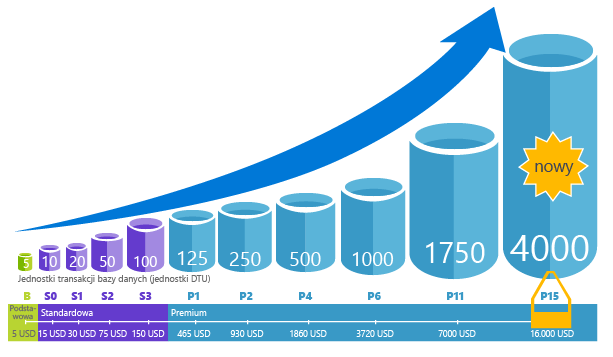

# Wyjaśnienie jednostek DTU (Database Transaction Units) i eDTU (elastic Database Transaction Units)Explaining Database Transaction Units (DTUs) and elastic Database Transaction Units (eDTUs)
W tym artykule opisano, że jednostki transakcji bazy danych (Dtu) i jednostek transakcji elastycznej bazy danych (Edtu) i co się stanie po naciśnięciu przycisku hello maksymalna liczba jednostek Dtu lub Edtu.This article explains Database Transaction Units (DTUs) and elastic Database Transaction Units (eDTUs) and what happens when you hit hello maximum DTUs or eDTUs.  

## Co to są jednostki DTU (Database Transaction Unit)What are Database Transaction Units (DTUs)
Dla jednej bazy danych Azure SQL w konkretnego poziomu wydajności w ramach [warstwy usług](sql-database-service-tiers.md#single-database-service-tiers-and-performance-levels), Microsoft gwarantuje pewnego poziomu zasobów dla tej bazy danych (niezależnie od innych bazy danych w hello chmury Azure) i przewidywalna poziom wydajności.For a single Azure SQL database at a specific performance level within a [service tier](sql-database-service-tiers.md#single-database-service-tiers-and-performance-levels), Microsoft guarantees a certain level of resources for that database (independent of any other database in hello Azure cloud) and providing a predictable level of performance. Ta ilość zasobów jest obliczany jako liczba jednostek transakcji bazy danych lub Dtu i jest mieszanych pomiarach Procesora, pamięci, we/wy (danych i dziennika transakcji we/wy).This amount of resources is calculated as a number of Database Transaction Units or DTUs, and is a blended measure of CPU, memory, I/O (data and transaction log I/O). współczynnik Hello spośród tych zasobów pierwotnie został określony poprzez [obciążenia OLTP testu porównawczego](sql-database-benchmark-overview.md) zaprojektowane toobe typowe dla obciążeń OLTP rzeczywistych.hello ratio amongst these resources was originally determined by an [OLTP benchmark workload](sql-database-benchmark-overview.md) designed toobe typical of real-world OLTP workloads. Gdy obciążenie przekracza wielkość hello któregokolwiek z tych zasobów, przepustowość sieci jest ograniczeniem przepustowości — wynikowe w niska wydajność i przekroczeń limitu czasu.When your workload exceeds hello amount of any of these resources, your throughput is throttled - resulting in slower performance and timeouts. Hello zasoby używane przez obciążenie będzie mieć wpływu na powitania zasoby dostępne tooother baz danych w hello chmury Azure i zasobów hello używany przez inne obciążenia nie wpływają na hello zasoby dostępne tooyour SQL w bazie danych.hello resources used by your workload do not impact hello resources available tooother SQL databases in hello Azure cloud, and hello resource used by other workloads do not impact hello resources available tooyour SQL database.

Liczba jednostek Dtu są najbardziej przydatne dla zrozumienia hello względną ilość zasobów między bazami danych SQL Azure na różne poziomy wydajności i warstwy usług.DTUs are most useful for understanding hello relative amount of resources between Azure SQL Databases at different performance levels and service tiers. Na przykład podwojenie Dtu powitania po podniesieniu poziomu wydajności hello bazy danych oznacza zestaw hello toodoubling toothat dostępnych zasobów w bazie danych.For example, doubling hello DTUs by increasing hello performance level of a database equates toodoubling hello set of resource available toothat database. Na przykład baza danych Premium P11 z 1750 jednostkami DTU zapewnia 350 razy więcej mocy obliczeniowej DTU niż podstawowa baza danych z 5 jednostkami DTU.For example, a Premium P11 database with 1750 DTUs provides 350x more DTU compute power than a Basic database with 5 DTUs.  

toogain lepszy wgląd w zużycie zasobów (bazy danych DTU) hello obciążenia, użyj [szczegółowe informacje o usłudze Azure SQL bazy danych zapytań wydajności](sql-database-query-performance.md) do:toogain deeper insight into hello resource (DTU) consumption of your workload, use [Azure SQL Database Query Performance Insight](sql-database-query-performance.md) to:

- Identyfikowanie najważniejszych zapytań hello według liczby wykonywania-Procesor/czas trwania, który może potencjalnie dostroić zwiększonej wydajności.Identify hello top queries by CPU/Duration/Execution count that can potentially be tuned for improved performance. Na przykład kwerendę intensywne operacje We/Wy mogą korzystać z użycia hello [techniki optymalizacji w pamięci](sql-database-in-memory.md) toomake lepsze wykorzystanie pamięci hello w niektórych warstwę i poziom wydajności usługi.For example, an I/O intensive query might benefit from hello use of [in-memory optimization techniques](sql-database-in-memory.md) toomake better use of hello available memory at a certain service tier and performance level.
- Przechodzenie do szczegółów hello zapytania, Wyświetl tekst i historii wykorzystania zasobów.Drill down into hello details of a query, view its text and history of resource utilization.
- Dostosowywanie zaleceń, które zawierają akcje wykonywane przez wydajności dostępu [doradcy bazy danych SQL](sql-database-advisor.md).Access performance tuning recommendations that show actions performed by [SQL Database Advisor](sql-database-advisor.md).

Możesz [zmiana warstw usług](sql-database-service-tiers.md) w dowolnym momencie z minimalnym czasem przestojów tooyour aplikacji (zwykle uśrednianie poniżej cztery sekund).You can [change service tiers](sql-database-service-tiers.md) at any time with minimal downtime tooyour application (generally averaging under four seconds). Dla wielu firm i aplikacji jest w stanie toocreate baz danych i wybrać wydajności w górę lub w dół na żądanie jest wystarczająca, zwłaszcza jeśli wzorce użycia są względnie przewidywalne.For many businesses and apps, being able toocreate databases and dial performance up or down on demand is enough, especially if usage patterns are relatively predictable. Ale jeśli masz nieprzewidywalnych wzorców, może być twarde toomanage kosztów i modelem biznesowym.But if you have unpredictable usage patterns, it can make it hard toomanage costs and your business model. W tym scenariuszu używany z określonej liczby jednostek Edtu, które są współużytkowane przez wiele bazy danych w puli hello puli elastycznej.For this scenario, you use an elastic pool with a certain number of eDTUs that are shared among multiple database in hello pool.

## Co to są jednostki eDTU (elastic Database Transaction Unit)What are elastic Database Transaction Units (eDTUs)
Raczej nie udostępniają dedykowany zestaw zasobów (Dtu) tooa bazy danych SQL, która jest zawsze dostępna niezależnie od tego, czy potrzebne nie, możesz umieścić baz danych do [puli elastycznej](sql-database-elastic-pool.md) na serwerze bazy danych SQL, który współużytkuje puli zasobów wśród tych bazy danych.Rather than provide a dedicated set of resources (DTUs) tooa SQL Database that is always available regardless of whether needed not, you can place databases into an [elastic pool](sql-database-elastic-pool.md) on a SQL Database server that shares a pool of resources among those database. Hello udostępnionych zasobów w puli elastycznej, mierząc elastycznych jednostkach transakcji bazy danych lub Edtu.hello shared resources in an elastic pool measured by elastic Database Transaction Units or eDTUs. Pule elastyczne Podaj prostym rozwiązaniem ekonomiczne cele wydajności hello toomanage dla wielu baz danych, które mają różnymi i nieprzewidywalnych wzorców.Elastic pools provide a simple cost effective solution toomanage hello performance goals for multiple databases that have widely varying and unpredictable usage patterns. W puli elastycznej może zagwarantować nie jedna baza danych używa wszystkich zasobów hello w puli hello oraz czy minimalna ilość zasobów jest zawsze bazy danych tooa dostępne w puli elastycznej.In an elastic pool, you can guarantee that no one database uses all of hello resources in hello pool and also that a minimum amount of resources is always available tooa database in an elastic pool. Zobacz [pule elastyczne](sql-database-elastic-pool.md) Aby uzyskać więcej informacji.See  [elastic pools](sql-database-elastic-pool.md) for more information.

Puli jest przydzielana określona liczba jednostek eDTU za określoną cenę.A pool is given a set number of eDTUs, for a set price. W puli elastycznej hello pojedynczych baz danych są podane hello elastyczność tooauto skali w granicach hello skonfigurowane.Within hello elastic pool, individual databases are given hello flexibility tooauto-scale within hello configured boundaries. Duże obciążenie bazy danych mogą zużywać więcej jednostek Edtu toomeet żądanie podczas baz danych w ramach lekkie ładunki zużywają mniej się punkt toohello, że bazy danych w ramach obciążenia korzystać z nie jednostek Edtu.Under heavy load, a database can consume more eDTUs toomeet demand while databases under light loads consume less, up toohello point that databases under no load consume no eDTUs. Inicjowanie obsługi zasobów dla całej puli hello, zamiast na bazę danych, zadania zarządzania są uproszczone i mają przewidywalna budżetu hello puli.By provisioning resources for hello entire pool, rather than per database, management tasks are simplified and you have a predictable budget for hello pool.

Dodatkowe Edtu można dodać istniejącej puli tooan bez przestojów bazy danych i bez wpływu na hello hello puli baz danych.Additional eDTUs can be added tooan existing pool with no database downtime and with no impact on hello databases in hello pool. Podobnie jeśli dodatkowe jednostki eDTU nie są już potrzebne, można je usunąć z istniejącej puli w dowolnej chwili.Similarly, if extra eDTUs are no longer needed, they can be removed from an existing pool at any point in time. Można dodawać lub odjęcia puli toohello baz danych lub kwota hello limitu liczby jednostek Edtu bazy danych można użyć w obszarze obciążony tooreserve Edtu dla innych baz danych.You can add or subtract databases toohello pool, or limit hello amount of eDTUs a database can use under heavy load tooreserve eDTUs for other databases. Jeśli bazy danych jest jednoznacznie w obszarze wykorzystaniem zasobów, można wychodzenia hello puli i skonfigurować go jako pojedynczej bazy danych z przewidywalną ilość zasobów wymaga.If a database is predictably under-utilizing resources, you can move it out of hello pool and configure it as a single database with predictable amount of resources it requires.

## Jak ustalić, hello liczba jednostek Dtu wymaganych przez obciążenie mojej?How can I determine hello number of DTUs needed by my workload?
Jeśli szukasz toomigrate istniejącym lokalnym lub tooAzure obciążenie maszyny wirtualnej programu SQL Server bazy danych SQL, można użyć hello [kalkulatora DTU](http://dtucalculator.azurewebsites.net/) tooapproximate hello liczbę jednostek Dtu potrzebne.If you are looking toomigrate an existing on-premises or SQL Server virtual machine workload tooAzure SQL Database, you can use hello [DTU Calculator](http://dtucalculator.azurewebsites.net/) tooapproximate hello number of DTUs needed. Istniejące obciążenia pracą bazy danych SQL Azure, można użyć [Insight wydajności kwerendy bazy danych SQL](sql-database-query-performance.md) toounderstand Twojej bazy danych zasobów zużycie (Dtu) tooget lepszy wgląd w sposób toooptimize obciążenie.For an existing Azure SQL Database workload, you can use [SQL Database Query Performance Insight](sql-database-query-performance.md) toounderstand your database resource consumption (DTUs) tooget deeper insight into how toooptimize your workload. Można również użyć hello [sys.dm_db_ resource_stats](https://msdn.microsoft.com/library/dn800981.aspx) DMV tooget hello zasobów informacji dotyczących zużycia hello 1 godzinę.You can also use hello [sys.dm_db_ resource_stats](https://msdn.microsoft.com/library/dn800981.aspx) DMV tooget hello resource consumption information for hello last one hour. Alternatywnie hello widoku wykazu [sys.resource_stats](http://msdn.microsoft.com/library/dn269979.aspx) może również być tooget, którego dotyczy kwerenda hello te same dane dla hello ostatnie 14 dni, chociaż na dolnym wierności średnich 5 minutową.Alternatively, hello catalog view [sys.resource_stats](http://msdn.microsoft.com/library/dn269979.aspx) can also be queried tooget hello same data for hello last 14 days, although at a lower fidelity of five-minute averages.

## Jak sprawdzić, czy elastyczna pula zasobów jest dla mnie korzystnym rozwiązaniem?How do I know if I could benefit from an elastic pool of resources?
Pule są odpowiednie dla wielu baz danych o określonych wzorcach użycia.Pools are suited for a large number of databases with specific utilization patterns. Dla danej bazy danych ten wzorzec charakteryzuje się niskim średnim wykorzystaniem oraz stosunkowo rzadkimi okresami zwiększonego użycia.For a given database, this pattern is characterized by low average utilization with relatively infrequent utilization spikes. Baza danych SQL automatycznie ocenia użycie zasobów historycznych hello baz danych na istniejącym serwerze bazy danych SQL i zaleca konfiguracji odpowiedniej puli hello w hello portalu Azure.SQL Database automatically evaluates hello historical resource usage of databases in an existing SQL Database server and recommends hello appropriate pool configuration in hello Azure portal. Aby uzyskać więcej informacji, zobacz [Kiedy należy użyć puli elastycznej?](sql-database-elastic-pool.md)For more information, see [when should an elastic pool be used?](sql-database-elastic-pool.md)

## Co się stanie po osiągnięciu limitu jednostek DTU?What happens when I hit my maximum DTUs
Poziomy wydajności są kalibrować i której działalność tooprovide hello wymagane zasoby toorun obciążenie bazy danych się toohello limity maksymalny dozwolony poziom warstwy wydajności wybranej usługi.Performance levels are calibrated and governed tooprovide hello needed resources toorun your database workload up toohello max limits allowed for your selected service tier/performance level. Jeżeli obciążenie jest naciśnięcie limity hello w jednym z ograniczeń we/wy procesora CPU/dane we/wy/Log, nadal tooreceive hello zasobów na powitania maksymalny dozwolony poziom, ale są prawdopodobnie toosee zwiększyć opóźnienia dla zapytań.If your workload is hitting hello limits in one of CPU/Data IO/Log IO limits, you continue tooreceive hello resources at hello maximum allowed level, but you are likely toosee increased latencies for your queries. Te limity nie spowoduje żadnych błędów, ale raczej spowolnienie obciążenia pracą hello, chyba że spowolnienie hello staje się tak poważne, że zapytania uruchamiane chronometrażu. W przypadku osiągnięcia limitów maksymalnej dozwolonej liczby równoczesnych sesji/żądań użytkowników (wątków roboczych) występują jawne błędy.These limits do not result in any errors, but rather a slowdown in hello workload, unless hello slowdown becomes so severe that queries start timing out. If you are hitting limits of maximum allowed concurrent user sessions/requests (worker threads), you see explicit errors. Zobacz [Limity zasobów usługi Azure SQL Database](sql-database-resource-limits.md), aby uzyskać informacje na temat limitów zasobów innych niż procesor CPU, pamięć, operacje we/wy danych oraz operacje we/wy dziennika transakcji.See [Azure SQL Database resource limits](sql-database-resource-limits.md) for information on limit on resources other than CPU, memory, data I/O, and transaction log I/O.

## Następne krokiNext steps
* Zobacz [warstwy usług](sql-database-service-tiers.md) informacji na temat jednostek Dtu hello i jednostek Edtu dostępnych dla pojedynczych baz danych i elastyczne pule.See [Service tier](sql-database-service-tiers.md) for information on hello DTUs and eDTUs available for single databases and for elastic pools.
* Zobacz [Limity zasobów usługi Azure SQL Database](sql-database-resource-limits.md), aby uzyskać informacje na temat limitów zasobów innych niż procesor CPU, pamięć, operacje we/wy danych oraz operacje we/wy dziennika transakcji.See [Azure SQL Database resource limits](sql-database-resource-limits.md) for information on limit on resources other than CPU, memory, data I/O, and transaction log I/O.
* Zobacz [Insight wydajności kwerendy bazy danych SQL](sql-database-query-performance.md) toounderstand użycia (Dtu).See [SQL Database Query Performance Insight](sql-database-query-performance.md) toounderstand your (DTUs) consumption.
* Zobacz [omówienie testów porównawczych bazy danych SQL](sql-database-benchmark-overview.md) metodologii hello toounderstand za hello OLTP testu obciążenia używane hello toodetermine blend jednostek dtu w warstwie.See [SQL Database benchmark overview](sql-database-benchmark-overview.md) toounderstand hello methodology behind hello OLTP benchmark workload used toodetermine hello DTU blend.
