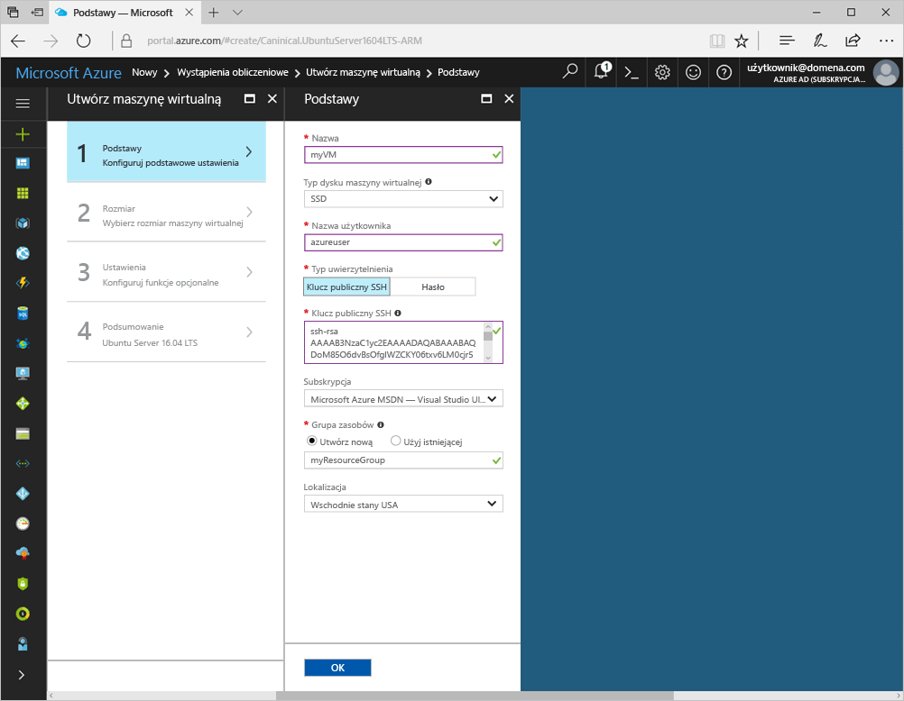
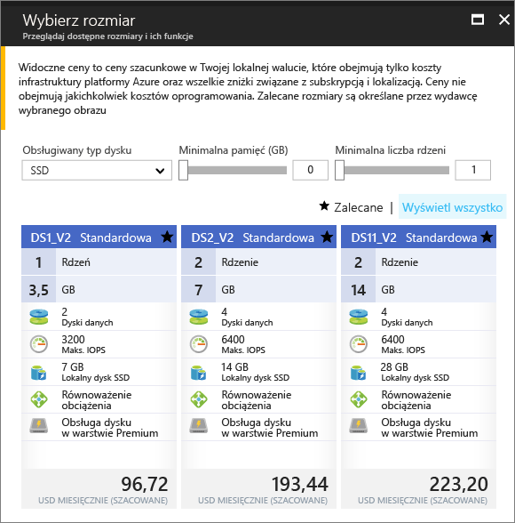

# <a name="create-a-linux-virtual-machine-with-hello-azure-portal"></a><span data-ttu-id="62552-103">Utwórz maszynę wirtualną systemu Linux z hello portalu Azure</span><span class="sxs-lookup"><span data-stu-id="62552-103">Create a Linux virtual machine with hello Azure portal</span></span>

<span data-ttu-id="62552-104">Maszyny wirtualne platformy Azure mogą być tworzone za pomocą hello portalu Azure.</span><span class="sxs-lookup"><span data-stu-id="62552-104">Azure virtual machines can be created through hello Azure portal.</span></span> <span data-ttu-id="62552-105">Ta metoda bazuje na opartym na przeglądarce interfejsie użytkownika umożliwiającym tworzenie i konfigurowanie maszyn wirtualnych oraz wszystkich pokrewnych zasobów.</span><span class="sxs-lookup"><span data-stu-id="62552-105">This method provides a browser-based user interface for creating and configuring virtual machines and all related resources.</span></span> <span data-ttu-id="62552-106">Ta procedura Szybki Start do utworzenia maszyny wirtualnej oraz jest instalowany serwer sieci Web na powitania maszyny Wirtualnej.</span><span class="sxs-lookup"><span data-stu-id="62552-106">This Quickstart steps through creating a virtual machine and installing a webserver on hello VM.</span></span>

<span data-ttu-id="62552-107">Jeśli nie masz subskrypcji platformy Azure, przed rozpoczęciem utwórz [bezpłatne konto](https://azure.microsoft.com/free/?WT.mc_id=A261C142F).</span><span class="sxs-lookup"><span data-stu-id="62552-107">If you don't have an Azure subscription, create a [free account](https://azure.microsoft.com/free/?WT.mc_id=A261C142F) before you begin.</span></span>

## <a name="create-ssh-key-pair"></a><span data-ttu-id="62552-108">Tworzenie pary kluczy SSH</span><span class="sxs-lookup"><span data-stu-id="62552-108">Create SSH key pair</span></span>

<span data-ttu-id="62552-109">Należy toocomplete pary kluczy SSH to szybki start.</span><span class="sxs-lookup"><span data-stu-id="62552-109">You need an SSH key pair toocomplete this quick start.</span></span> <span data-ttu-id="62552-110">Jeśli masz już parę kluczy SSH, możesz pominąć ten krok.</span><span class="sxs-lookup"><span data-stu-id="62552-110">If you have an existing SSH key pair, this step can be skipped.</span></span>

<span data-ttu-id="62552-111">Z powłoki Bash Uruchom to polecenie i wykonaj hello na ekranie instrukcjami.</span><span class="sxs-lookup"><span data-stu-id="62552-111">From a Bash shell, run this command and follow hello on-screen directions.</span></span> <span data-ttu-id="62552-112">dane wyjściowe polecenia Hello zawiera nazwę pliku hello z hello pliku klucza publicznego.</span><span class="sxs-lookup"><span data-stu-id="62552-112">hello command output includes hello file name of hello public key file.</span></span> <span data-ttu-id="62552-113">Kopiuj zawartość hello hello pliku klucza publicznego toohello Schowka.</span><span class="sxs-lookup"><span data-stu-id="62552-113">Copy hello contents of hello public key file toohello clipboard.</span></span>

```bash
ssh-keygen -t rsa -b 2048
```

## <a name="log-in-tooazure"></a><span data-ttu-id="62552-114">Zaloguj się za tooAzure</span><span class="sxs-lookup"><span data-stu-id="62552-114">Log in tooAzure</span></span> 

<span data-ttu-id="62552-115">Zaloguj się za toohello portalu Azure w http://portal.azure.com.</span><span class="sxs-lookup"><span data-stu-id="62552-115">Log in toohello Azure portal at http://portal.azure.com.</span></span>

## <a name="create-virtual-machine"></a><span data-ttu-id="62552-116">Tworzenie maszyny wirtualnej</span><span class="sxs-lookup"><span data-stu-id="62552-116">Create virtual machine</span></span>

1. <span data-ttu-id="62552-117">Kliknij przycisk hello **nowy** znaleziono przycisku na powitania lewym górnym rogu hello portalu Azure.</span><span class="sxs-lookup"><span data-stu-id="62552-117">Click hello **New** button found on hello upper left-hand corner of hello Azure portal.</span></span>

2. <span data-ttu-id="62552-118">Wybierz pozycję **Wystąpienia obliczeniowe**, a następnie wybierz pozycję **Ubuntu Server 16.04 LTS**.</span><span class="sxs-lookup"><span data-stu-id="62552-118">Select **Compute**, and then select **Ubuntu Server 16.04 LTS**.</span></span> 

3. <span data-ttu-id="62552-119">Wprowadź informacje o maszynie wirtualnej hello.</span><span class="sxs-lookup"><span data-stu-id="62552-119">Enter hello virtual machine information.</span></span> <span data-ttu-id="62552-120">W obszarze **Typ uwierzytelniania** wybierz pozycję **Klucz publiczny SSH**.</span><span class="sxs-lookup"><span data-stu-id="62552-120">For **Authentication type**, select **SSH public key**.</span></span> <span data-ttu-id="62552-121">Podczas wklejania w klucz publiczny SSH, należy zadbać tooremove żadnego odstępu wiodących lub końcowych.</span><span class="sxs-lookup"><span data-stu-id="62552-121">When pasting in your SSH public key, take care tooremove any leading or trailing white space.</span></span> <span data-ttu-id="62552-122">Po zakończeniu kliknij przycisk **OK**.</span><span class="sxs-lookup"><span data-stu-id="62552-122">When complete, click **OK**.</span></span>

    

4. <span data-ttu-id="62552-124">Wybierz rozmiar hello maszyny Wirtualnej.</span><span class="sxs-lookup"><span data-stu-id="62552-124">Select a size for hello VM.</span></span> <span data-ttu-id="62552-125">Wybierz więcej rozmiary toosee **Wyświetl wszystkie** lub zmień hello **obsługiwany typ dysku** filtru.</span><span class="sxs-lookup"><span data-stu-id="62552-125">toosee more sizes, select **View all** or change hello **Supported disk type** filter.</span></span> 

      

5. <span data-ttu-id="62552-127">W bloku ustawień hello zachować hello wartości domyślne, a następnie kliknij przycisk **OK**.</span><span class="sxs-lookup"><span data-stu-id="62552-127">On hello settings blade, keep hello defaults and click **OK**.</span></span>

6. <span data-ttu-id="62552-128">Na stronie Podsumowanie powitania kliknij **Ok** wdrożenia maszyny wirtualnej hello toostart.</span><span class="sxs-lookup"><span data-stu-id="62552-128">On hello summary page, click **Ok** toostart hello virtual machine deployment.</span></span>

7. <span data-ttu-id="62552-129">Witaj maszyny Wirtualnej będzie przypiętych toohello pulpitu nawigacyjnego portalu Azure.</span><span class="sxs-lookup"><span data-stu-id="62552-129">hello VM will be pinned toohello Azure portal dashboard.</span></span> <span data-ttu-id="62552-130">Po zakończeniu wdrażania hello bloku podsumowania hello maszyny Wirtualnej automatycznie otwiera.</span><span class="sxs-lookup"><span data-stu-id="62552-130">Once hello deployment has completed, hello VM summary blade automatically opens.</span></span>


## <a name="connect-toovirtual-machine"></a><span data-ttu-id="62552-131">Podłącz maszynę toovirtual</span><span class="sxs-lookup"><span data-stu-id="62552-131">Connect toovirtual machine</span></span>

<span data-ttu-id="62552-132">Utwórz połączenie SSH z maszyną wirtualną hello.</span><span class="sxs-lookup"><span data-stu-id="62552-132">Create an SSH connection with hello virtual machine.</span></span>

1. <span data-ttu-id="62552-133">Kliknij przycisk hello **Connect** przycisk na powitania bloku maszyny wirtualnej.</span><span class="sxs-lookup"><span data-stu-id="62552-133">Click hello **Connect** button on hello virtual machine blade.</span></span> <span data-ttu-id="62552-134">Witaj połączyć przedstawia przycisk ciąg połączenia SSH, który może być maszyny wirtualnej toohello tooconnect używane.</span><span class="sxs-lookup"><span data-stu-id="62552-134">hello connect button displays an SSH connection string that can be used tooconnect toohello virtual machine.</span></span>

     

2. <span data-ttu-id="62552-136">Witaj uruchom następujące polecenie toocreate jako sesji SSH.</span><span class="sxs-lookup"><span data-stu-id="62552-136">Run hello following command toocreate an SSH session.</span></span> <span data-ttu-id="62552-137">Zastąp ciąg połączenia hello hello jeden skopiowane z hello portalu Azure.</span><span class="sxs-lookup"><span data-stu-id="62552-137">Replace hello connection string with hello one you copied from hello Azure portal.</span></span>

```bash 
ssh azureuser@40.112.21.50
```

## <a name="install-nginx"></a><span data-ttu-id="62552-138">Instalowanie serwera NGINX</span><span class="sxs-lookup"><span data-stu-id="62552-138">Install NGINX</span></span>

<span data-ttu-id="62552-139">Użyj następujących hello bash źródła pakietów tooupdate skryptu i zainstaluj najnowszy pakiet NGINX hello.</span><span class="sxs-lookup"><span data-stu-id="62552-139">Use hello following bash script tooupdate package sources and install hello latest NGINX package.</span></span> 

```bash 
#!/bin/bash

# update package source
sudo apt-get -y update

# install NGINX
sudo apt-get -y install nginx
```

<span data-ttu-id="62552-140">Po zakończeniu zamknij sesję SSH hello i zwróć hello właściwości maszyny Wirtualnej w portalu Azure hello.</span><span class="sxs-lookup"><span data-stu-id="62552-140">When done, exit hello SSH session and return hello VM properties in hello Azure portal.</span></span>


## <a name="open-port-80-for-web-traffic"></a><span data-ttu-id="62552-141">Otwieranie portu 80 na potrzeby ruchu w sieci Web</span><span class="sxs-lookup"><span data-stu-id="62552-141">Open port 80 for web traffic</span></span> 

<span data-ttu-id="62552-142">Sieciowa grupa zabezpieczeń zabezpiecza ruch przychodzący i wychodzący.</span><span class="sxs-lookup"><span data-stu-id="62552-142">A Network security group (NSG) secures inbound and outbound traffic.</span></span> <span data-ttu-id="62552-143">Po utworzeniu maszyny Wirtualnej z portalu Azure hello tworzona jest reguła dla ruchu przychodzącego na porcie 22 dla połączenia SSH.</span><span class="sxs-lookup"><span data-stu-id="62552-143">When a VM is created from hello Azure portal, an inbound rule is created on port 22 for SSH connections.</span></span> <span data-ttu-id="62552-144">Ponieważ ta maszyna wirtualna znajduje się serwer sieci Web, reguły NSG musi toobe utworzony dla portu 80.</span><span class="sxs-lookup"><span data-stu-id="62552-144">Because this VM hosts a webserver, an NSG rule needs toobe created for port 80.</span></span>

1. <span data-ttu-id="62552-145">Na maszynie wirtualnej hello, kliknij nazwę hello hello **grupy zasobów**.</span><span class="sxs-lookup"><span data-stu-id="62552-145">On hello virtual machine, click hello name of hello **Resource group**.</span></span>
2. <span data-ttu-id="62552-146">Wybierz hello **sieciowej grupy zabezpieczeń**.</span><span class="sxs-lookup"><span data-stu-id="62552-146">Select hello **network security group**.</span></span> <span data-ttu-id="62552-147">Witaj grupy NSG mogą zostać zidentyfikowane przy użyciu hello **typu** kolumny.</span><span class="sxs-lookup"><span data-stu-id="62552-147">hello NSG can be identified using hello **Type** column.</span></span> 
3. <span data-ttu-id="62552-148">W menu po lewej stronie powitania, w obszarze Ustawienia, kliknij polecenie **reguły zabezpieczeń dla ruchu przychodzącego**.</span><span class="sxs-lookup"><span data-stu-id="62552-148">On hello left-hand menu, under settings, click **Inbound security rules**.</span></span>
4. <span data-ttu-id="62552-149">Kliknij pozycję **Dodaj**.</span><span class="sxs-lookup"><span data-stu-id="62552-149">Click on **Add**.</span></span>
5. <span data-ttu-id="62552-150">W polu **Nazwa** wpisz wartość **http**.</span><span class="sxs-lookup"><span data-stu-id="62552-150">In **Name**, type **http**.</span></span> <span data-ttu-id="62552-151">Upewnij się, że **zakres portów** ustawiono too80 i **akcji** ustawiono zbyt**Zezwalaj**.</span><span class="sxs-lookup"><span data-stu-id="62552-151">Make sure **Port range** is set too80 and **Action** is set too**Allow**.</span></span> 
6. <span data-ttu-id="62552-152">Kliknij przycisk **OK**.</span><span class="sxs-lookup"><span data-stu-id="62552-152">Click **OK**.</span></span>


## <a name="view-hello-nginx-welcome-page"></a><span data-ttu-id="62552-153">Wyświetlanie hello NGINX strony powitalnej</span><span class="sxs-lookup"><span data-stu-id="62552-153">View hello NGINX welcome page</span></span>

<span data-ttu-id="62552-154">NGINX zainstalowana i port 80 Otwórz tooyour maszyny Wirtualnej, hello serwer sieci Web jest teraz dostępna z hello internet.</span><span class="sxs-lookup"><span data-stu-id="62552-154">With NGINX installed, and port 80 open tooyour VM, hello webserver can now be accessed from hello internet.</span></span> <span data-ttu-id="62552-155">Otwórz przeglądarkę sieci web, a następnie wprowadź hello publicznego adresu IP hello maszyny Wirtualnej.</span><span class="sxs-lookup"><span data-stu-id="62552-155">Open a web browser, and enter hello public IP address of hello VM.</span></span> <span data-ttu-id="62552-156">Witaj publiczny adres IP można znaleźć w bloku maszyny Wirtualnej hello w hello portalu Azure.</span><span class="sxs-lookup"><span data-stu-id="62552-156">hello public IP address can be found on hello VM blade in hello Azure portal.</span></span>

 

## <a name="clean-up-resources"></a><span data-ttu-id="62552-158">Oczyszczanie zasobów</span><span class="sxs-lookup"><span data-stu-id="62552-158">Clean up resources</span></span>

<span data-ttu-id="62552-159">Gdy nie są już potrzebne, Usuń grupy zasobów hello, maszyny wirtualnej i wszystkie powiązane zasoby.</span><span class="sxs-lookup"><span data-stu-id="62552-159">When no longer needed, delete hello resource group, virtual machine, and all related resources.</span></span> <span data-ttu-id="62552-160">toodo tak, zaznacz grupę zasobów hello hello bloku maszyny wirtualnej i kliknij przycisk **usunąć**.</span><span class="sxs-lookup"><span data-stu-id="62552-160">toodo so, select hello resource group from hello virtual machine blade and click **Delete**.</span></span>

## <a name="next-steps"></a><span data-ttu-id="62552-161">Następne kroki</span><span class="sxs-lookup"><span data-stu-id="62552-161">Next steps</span></span>

<span data-ttu-id="62552-162">W tym przewodniku Szybki start została wdrożona prosta maszyna wirtualna i reguła sieciowej grupy zabezpieczeń oraz zainstalowano serwer sieci Web.</span><span class="sxs-lookup"><span data-stu-id="62552-162">In this quick start, you’ve deployed a simple virtual machine, a network security group rule, and installed a web server.</span></span> <span data-ttu-id="62552-163">toolearn więcej informacji o maszynach wirtualnych platformy Azure, nadal samouczek toohello dla maszyn wirtualnych systemu Linux.</span><span class="sxs-lookup"><span data-stu-id="62552-163">toolearn more about Azure virtual machines, continue toohello tutorial for Linux VMs.</span></span>

> [!div class="nextstepaction"]
> [<span data-ttu-id="62552-164">Samouczki dla maszyny wirtualnej platformy Azure z systemem Linux</span><span class="sxs-lookup"><span data-stu-id="62552-164">Azure Linux virtual machine tutorials</span></span>](./tutorial-manage-vm.md)
