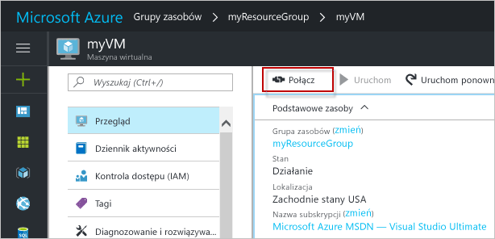

# <a name="create-a-linux-virtual-machine-with-hello-azure-portal"></a>Utwórz maszynę wirtualną systemu Linux z hello portalu Azure

Maszyny wirtualne platformy Azure mogą być tworzone za pomocą hello portalu Azure. Ta metoda bazuje na opartym na przeglądarce interfejsie użytkownika umożliwiającym tworzenie i konfigurowanie maszyn wirtualnych oraz wszystkich pokrewnych zasobów. Ta procedura Szybki Start do utworzenia maszyny wirtualnej oraz jest instalowany serwer sieci Web na powitania maszyny Wirtualnej.

Jeśli nie masz subskrypcji platformy Azure, przed rozpoczęciem utwórz [bezpłatne konto](https://azure.microsoft.com/free/?WT.mc_id=A261C142F).

## <a name="create-ssh-key-pair"></a>Tworzenie pary kluczy SSH

Należy toocomplete pary kluczy SSH to szybki start. Jeśli masz już parę kluczy SSH, możesz pominąć ten krok.

Z powłoki Bash Uruchom to polecenie i wykonaj hello na ekranie instrukcjami. dane wyjściowe polecenia Hello zawiera nazwę pliku hello z hello pliku klucza publicznego. Kopiuj zawartość hello hello pliku klucza publicznego toohello Schowka.

```bash
ssh-keygen -t rsa -b 2048
```

## <a name="log-in-tooazure"></a>Zaloguj się za tooAzure 

Zaloguj się za toohello portalu Azure w http://portal.azure.com.

## <a name="create-virtual-machine"></a>Tworzenie maszyny wirtualnej

1. Kliknij przycisk hello **nowy** znaleziono przycisku na powitania lewym górnym rogu hello portalu Azure.

2. Wybierz pozycję **Wystąpienia obliczeniowe**, a następnie wybierz pozycję **Ubuntu Server 16.04 LTS**. 

3. Wprowadź informacje o maszynie wirtualnej hello. W obszarze **Typ uwierzytelniania** wybierz pozycję **Klucz publiczny SSH**. Podczas wklejania w klucz publiczny SSH, należy zadbać tooremove żadnego odstępu wiodących lub końcowych. Po zakończeniu kliknij przycisk **OK**.

    

4. Wybierz rozmiar hello maszyny Wirtualnej. Wybierz więcej rozmiary toosee **Wyświetl wszystkie** lub zmień hello **obsługiwany typ dysku** filtru. 

      

5. W bloku ustawień hello zachować hello wartości domyślne, a następnie kliknij przycisk **OK**.

6. Na stronie Podsumowanie powitania kliknij **Ok** wdrożenia maszyny wirtualnej hello toostart.

7. Witaj maszyny Wirtualnej będzie przypiętych toohello pulpitu nawigacyjnego portalu Azure. Po zakończeniu wdrażania hello bloku podsumowania hello maszyny Wirtualnej automatycznie otwiera.


## <a name="connect-toovirtual-machine"></a>Podłącz maszynę toovirtual

Utwórz połączenie SSH z maszyną wirtualną hello.

1. Kliknij przycisk hello **Connect** przycisk na powitania bloku maszyny wirtualnej. Witaj połączyć przedstawia przycisk ciąg połączenia SSH, który może być maszyny wirtualnej toohello tooconnect używane.

     

2. Witaj uruchom następujące polecenie toocreate jako sesji SSH. Zastąp ciąg połączenia hello hello jeden skopiowane z hello portalu Azure.

```bash 
ssh azureuser@40.112.21.50
```

## <a name="install-nginx"></a>Instalowanie serwera NGINX

Użyj następujących hello bash źródła pakietów tooupdate skryptu i zainstaluj najnowszy pakiet NGINX hello. 

```bash 
#!/bin/bash

# update package source
sudo apt-get -y update

# install NGINX
sudo apt-get -y install nginx
```

Po zakończeniu zamknij sesję SSH hello i zwróć hello właściwości maszyny Wirtualnej w portalu Azure hello.


## <a name="open-port-80-for-web-traffic"></a>Otwieranie portu 80 na potrzeby ruchu w sieci Web 

Sieciowa grupa zabezpieczeń zabezpiecza ruch przychodzący i wychodzący. Po utworzeniu maszyny Wirtualnej z portalu Azure hello tworzona jest reguła dla ruchu przychodzącego na porcie 22 dla połączenia SSH. Ponieważ ta maszyna wirtualna znajduje się serwer sieci Web, reguły NSG musi toobe utworzony dla portu 80.

1. Na maszynie wirtualnej hello, kliknij nazwę hello hello **grupy zasobów**.
2. Wybierz hello **sieciowej grupy zabezpieczeń**. Witaj grupy NSG mogą zostać zidentyfikowane przy użyciu hello **typu** kolumny. 
3. W menu po lewej stronie powitania, w obszarze Ustawienia, kliknij polecenie **reguły zabezpieczeń dla ruchu przychodzącego**.
4. Kliknij pozycję **Dodaj**.
5. W polu **Nazwa** wpisz wartość **http**. Upewnij się, że **zakres portów** ustawiono too80 i **akcji** ustawiono zbyt**Zezwalaj**. 
6. Kliknij przycisk **OK**.


## <a name="view-hello-nginx-welcome-page"></a>Wyświetlanie hello NGINX strony powitalnej

NGINX zainstalowana i port 80 Otwórz tooyour maszyny Wirtualnej, hello serwer sieci Web jest teraz dostępna z hello internet. Otwórz przeglądarkę sieci web, a następnie wprowadź hello publicznego adresu IP hello maszyny Wirtualnej. Witaj publiczny adres IP można znaleźć w bloku maszyny Wirtualnej hello w hello portalu Azure.

 

## <a name="clean-up-resources"></a>Oczyszczanie zasobów

Gdy nie są już potrzebne, Usuń grupy zasobów hello, maszyny wirtualnej i wszystkie powiązane zasoby. toodo tak, zaznacz grupę zasobów hello hello bloku maszyny wirtualnej i kliknij przycisk **usunąć**.

## <a name="next-steps"></a>Następne kroki

W tym przewodniku Szybki start została wdrożona prosta maszyna wirtualna i reguła sieciowej grupy zabezpieczeń oraz zainstalowano serwer sieci Web. toolearn więcej informacji o maszynach wirtualnych platformy Azure, nadal samouczek toohello dla maszyn wirtualnych systemu Linux.

> [!div class="nextstepaction"]
> [Samouczki dla maszyny wirtualnej platformy Azure z systemem Linux](./tutorial-manage-vm.md)
