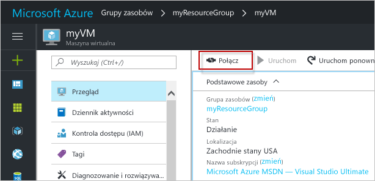

# <a name="create-a-windows-virtual-machine-with-hello-azure-portal"></a>Utwórz maszynę wirtualną systemu Windows z hello portalu Azure

Maszyny wirtualne platformy Azure mogą być tworzone za pomocą hello portalu Azure. Ta metoda bazuje na opartym na przeglądarce interfejsie użytkownika umożliwiającym tworzenie i konfigurowanie maszyn wirtualnych oraz wszystkich pokrewnych zasobów. Ta procedura Szybki Start do utworzenia maszyny wirtualnej oraz jest instalowany serwer sieci Web na powitania maszyny Wirtualnej.

Jeśli nie masz subskrypcji platformy Azure, przed rozpoczęciem utwórz [bezpłatne konto](https://azure.microsoft.com/free/?WT.mc_id=A261C142F).

## <a name="log-in-tooazure"></a>Zaloguj się za tooAzure

Zaloguj się za toohello portalu Azure w http://portal.azure.com.

## <a name="create-virtual-machine"></a>Tworzenie maszyny wirtualnej

1. Kliknij przycisk hello **nowy** znaleziono przycisku na powitania lewym górnym rogu hello portalu Azure.

2. Wybierz pozycję **Wystąpienia obliczeniowe**, a następnie wybierz pozycję **Windows Server 2016 Datacenter**. 

3. Wprowadź informacje o maszynie wirtualnej hello. Hello nazwy użytkownika i hasła wprowadzonego w tym miejscu jest używane toolog toohello maszynie wirtualnej. Po zakończeniu kliknij przycisk **OK**.

      

4. Wybierz rozmiar hello maszyny Wirtualnej. Wybierz więcej rozmiary toosee **Wyświetl wszystkie** lub zmień hello **obsługiwany typ dysku** filtru. 

      

5. W bloku ustawień hello zachować hello wartości domyślne, a następnie kliknij przycisk **OK**.

6. Na stronie Podsumowanie powitania kliknij **Ok** wdrożenia maszyny wirtualnej hello toostart.

7. Witaj maszyny Wirtualnej będzie przypiętych toohello pulpitu nawigacyjnego portalu Azure. Po zakończeniu wdrażania hello bloku podsumowania hello maszyny Wirtualnej automatycznie otwiera.


## <a name="connect-toovirtual-machine"></a>Podłącz maszynę toovirtual

Utwórz maszynę wirtualną toohello połączeń usług pulpitu zdalnego.

1. Kliknij przycisk hello **Connect** przycisk na powitania właściwości maszyny wirtualnej. Zostanie utworzony i pobrany plik Remote Desktop Protocol (rdp).

     

2. tooyour tooconnect maszynę Wirtualną, otwórz hello pobrany plik RDP. Jeśli zostanie wyświetlony monit, kliknij przycisk **Połącz**. Na komputerze Mac, należy klienta RDP, takich jak ta [klienta usług pulpitu zdalnego](https://itunes.apple.com/us/app/microsoft-remote-desktop/id715768417?mt=12) z hello Mac App Store.

3. Wprowadź hello nazwę użytkownika i hasło określone podczas tworzenia maszyny wirtualnej hello, a następnie kliknij przycisk **Ok**.

4. Może pojawić się ostrzeżenie o certyfikacie podczas hello procesu logowania. Kliknij przycisk **tak** lub **Kontynuuj** tooproceed z połączeniem hello.


## <a name="install-iis-using-powershell"></a>Instalowanie usług IIS przy użyciu programu PowerShell

Na maszynie wirtualnej hello Uruchom sesję programu PowerShell i uruchom hello następujące polecenia tooinstall usług IIS.

```powershell
Install-WindowsFeature -name Web-Server -IncludeManagementTools
```

Po zakończeniu zamknąć sesji protokołu RDP hello i zwróć hello właściwości maszyny Wirtualnej na powitania portalu Azure.

## <a name="open-port-80-for-web-traffic"></a>Otwieranie portu 80 na potrzeby ruchu w sieci Web 

Sieciowa grupa zabezpieczeń zabezpiecza ruch przychodzący i wychodzący. Po utworzeniu maszyny Wirtualnej z portalu Azure hello tworzona jest reguła dla ruchu przychodzącego z portu 3389 połączenia RDP. Ponieważ ta maszyna wirtualna znajduje się serwer sieci Web, reguły NSG musi toobe utworzony dla portu 80.

1. Na maszynie wirtualnej hello, kliknij nazwę hello hello **grupy zasobów**.
2. Wybierz hello **sieciowej grupy zabezpieczeń**. Witaj grupy NSG mogą zostać zidentyfikowane przy użyciu hello **typu** kolumny. 
3. W menu po lewej stronie powitania, w obszarze Ustawienia, kliknij polecenie **reguły zabezpieczeń dla ruchu przychodzącego**.
4. Kliknij pozycję **Dodaj**.
5. W polu **Nazwa** wpisz wartość **http**. Upewnij się, że **zakres portów** ustawiono too80 i **akcji** ustawiono zbyt**Zezwalaj**. 
6. Kliknij przycisk **OK**.


## <a name="view-hello-iis-welcome-page"></a>Widok hello strona powitalna usług IIS

Z programem IIS zainstalowanych i port 80 Otwórz tooyour maszyny Wirtualnej, hello serwer sieci Web jest teraz dostępna z hello internet. Otwórz przeglądarkę sieci web, a następnie wprowadź hello publicznego adresu IP hello maszyny Wirtualnej. Witaj publiczny adres IP można znaleźć w bloku maszyny Wirtualnej hello w hello portalu Azure.

 

## <a name="clean-up-resources"></a>Oczyszczanie zasobów

Gdy nie są już potrzebne, Usuń grupy zasobów hello, maszyny wirtualnej i wszystkie powiązane zasoby. toodo tak, zaznacz grupę zasobów hello hello bloku maszyny wirtualnej i kliknij przycisk **usunąć**.

## <a name="next-steps"></a>Następne kroki

W tym przewodniku Szybki start została wdrożona prosta maszyna wirtualna i reguła sieciowej grupy zabezpieczeń oraz zainstalowano serwer sieci Web. toolearn więcej informacji o maszynach wirtualnych platformy Azure, nadal samouczek toohello dla maszyn wirtualnych systemu Windows.

> [!div class="nextstepaction"]
> [Samouczki dla maszyny wirtualnej platformy Azure z systemem Windows](./tutorial-manage-vm.md)
