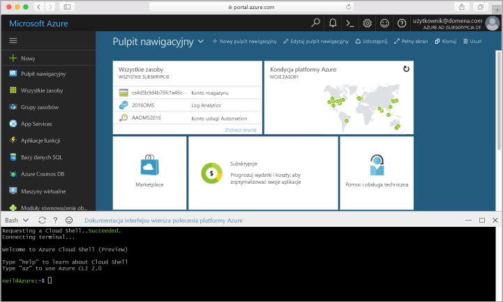

## Uruchamianie usługi Azure Cloud Shell

Hello powłoki chmury Azure jest bezpłatna powłoki Bash, który można uruchomić bezpośrednio z poziomu hello portalu Azure. Ma ona hello Azure CLI wstępnie zainstalowane i skonfigurowane toouse z Twoim kontem. Kliknij przycisk hello **powłoki chmury** przycisk menu hello w hello prawym górnym rogu hello [portalu Azure](https://portal.azure.com).

przycisk Hello uruchamia interakcyjne powłoki, pomocne toorun wszystkie hello kroków w tym temacie:

