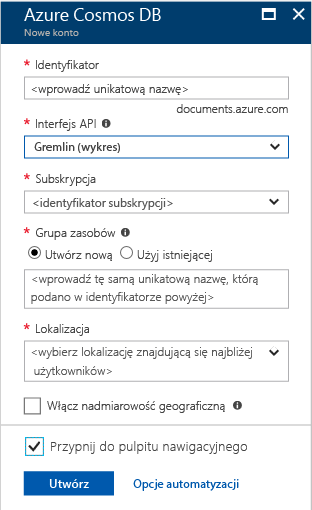

1. W nowym oknie zaloguj się do witryny [Azure Portal](https://portal.azure.com/).In a new window, sign in to the [Azure portal](https://portal.azure.com/).
2. W okienku po lewej stronie kliknij pozycję **Nowy**, kliknij pozycję **Bazy danych**, a następnie w obszarze **Azure Cosmos DB** kliknij pozycję **Utwórz**.In the left pane, click **New**, click **Databases**, and then under **Azure Cosmos DB**, click **Create**.
   
   

3. W bloku **Nowe konto** określ żądaną konfigurację tego konta usługi Azure Cosmos DB.In the **New account** blade, specify the configuration that you want for this Azure Cosmos DB account. 

    Usługa Azure Cosmos DB umożliwia wybranie jednego z czterech modeli programowania: Gremlin (graf), MongoDB, SQL (DocumentDB) oraz Tabela (klucz-wartość). Każdy z tych modeli wymaga obecnie osobnego konta.With Azure Cosmos DB, you can choose one of four programming models: Gremlin (graph), MongoDB, SQL (DocumentDB), and Table (key-value), each which currently require a separate account.
       
    W tym artykule Szybki start będziemy programować przy użyciu interfejsu API programu Graph, dlatego podczas wypełniania formularza wybierz pozycję **Gremlin (graf)**.In this quick-start article, we program against the Graph API, so choose **Gremlin (graph)** as you fill out the form. Jeśli masz dane dokumentów z aplikacji wykazu, dane typu klucz/wartość (tabela) lub dane zmigrowane z aplikacji MongoDB, weź pod uwagę, że usługa Azure Cosmos DB może zapewnić globalnie rozproszoną platformę usługi bazy danych o wysokiej dostępności dla wszystkich Twoich aplikacji o znaczeniu krytycznym.If you have document data from a catalog app, key/value (table) data, or data that's migrated from a MongoDB app, realize that Azure Cosmos DB can provide a highly available, globally distributed database service platform for all your mission-critical applications.

    Wypełnij pola w bloku **Nowe konto**, używając informacji przedstawionych na poniższym zrzucie ekranu jako wskazówki — Twoje wartości mogą różnić się od wartości na zrzucie ekranu.Complete the fields on the **New account** blade, using the information in the following screenshot as a guide - your values may be different than the values in the screenshot.
 
    

    UstawienieSetting|Sugerowana wartośćSuggested value|OpisDescription
    ---|---|---
    IDID|*Unikatowa wartość**Unique value*|Unikatowa nazwa do identyfikacji tego konta usługi Azure Cosmos DB.A unique name that identifies this Azure Cosmos DB account. Ponieważ adres *documents.azure.com* jest dołączany do podanego identyfikatora w celu utworzenia identyfikatora URI, użyty identyfikator powinien być unikatowy, ale rozpoznawalny.Because *documents.azure.com* is appended to the ID that you provide to create your URI, use a unique but identifiable ID. Identyfikator może zawierać tylko małe litery, cyfry i znaki łącznika (-) oraz musi zawierać od 3 do 50 znaków.The ID must contain only lowercase letters, numbers, and the hyphen (-) character, and it must contain from 3 to 50 characters.
    Interfejs APIAPI|Gremlin (graf)Gremlin (graph)|W dalszej części będziemy programować przy użyciu [interfejsu API programu Graph](../articles/cosmos-db/graph-introduction.md).We program against the [Graph API](../articles/cosmos-db/graph-introduction.md) later in this article.|
    SubskrypcjaSubscription|*Twoja subskrypcja**Your subscription*|Subskrypcja platformy Azure, która ma być używana dla tego konta usługi Azure Cosmos DB.The Azure subscription that you want to use for this Azure Cosmos DB account. 
    Grupa zasobówResource Group|*Taka sama wartość jak identyfikator**The same value as ID*|Nazwa nowej grupy zasobów dla Twojego konta.The new resource group name for your account. Dla uproszczenia można użyć takiej samej nazwy jak identyfikator.For simplicity, you can use the same name as your ID. 
    LokalizacjaLocation|*Region najbliżej Twoich użytkowników**The region closest to your users*|Lokalizacja geograficzna, w której będzie hostowane Twoje konto usługi Azure Cosmos DB.The geographic location in which to host your Azure Cosmos DB account. Wybierz lokalizację znajdującą się najbliżej Twoich użytkowników, aby zapewnić im najszybszy dostęp do danych.Choose the location closest to your users to give them the fastest access to the data.

4. Kliknij przycisk **Utwórz**, aby utworzyć konto.Click **Create** to create the account.
5. Na górnym pasku narzędzi kliknij ikonę **Powiadomienia** , aby monitorować proces wdrażania.On the top toolbar, click the **Notifications** icon  to monitor the deployment process.

    

6.  Gdy w oknie Powiadomienia zostanie wyświetlona informacja o pomyślnym wdrożeniu, zamknij okno powiadomień i otwórz nowe konto z poziomu kafelka **Wszystkie zasoby** na pulpicie nawigacyjnym.When the Notifications window indicates the deployment succeeded, close the notification window and open the new account from the **All Resources** tile on the Dashboard. 

    