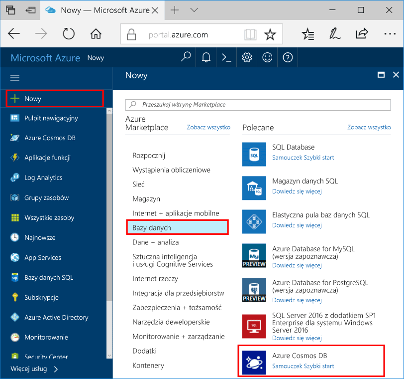

1. W nowym oknie, zaloguj się toohello [portalu Azure](https://portal.azure.com/).
2. W okienku po lewej stronie powitania kliknij **nowy**, kliknij przycisk **baz danych**, a następnie w obszarze **bazy danych Azure rozwiązania Cosmos**, kliknij przycisk **Utwórz**.
   
   

3. W hello **nowe konto** bloku będzie określić konfigurację hello, który ma obowiązywać dla tego konta bazy danych Azure rozwiązania Cosmos. 

    Usługa Azure Cosmos DB umożliwia wybranie jednego z czterech modeli programowania: Gremlin (graf), MongoDB, SQL (DocumentDB) oraz Tabela (klucz-wartość). Każdy z tych modeli wymaga obecnie osobnego konta.
       
    W tym artykule szybki start, firma Microsoft program względem hello interfejsu API programu Graph, więc należy wybrać **Gremlin (wykres)** w trakcie wypełniania hello formularza. Jeśli masz dane dokumentów z aplikacji wykazu, dane typu klucz/wartość (tabela) lub dane zmigrowane z aplikacji MongoDB, weź pod uwagę, że usługa Azure Cosmos DB może zapewnić globalnie rozproszoną platformę usługi bazy danych o wysokiej dostępności dla wszystkich Twoich aplikacji o znaczeniu krytycznym.

    Wypełnij pola hello na powitania **nowe konto** bloku, korzystając z informacji hello hello następujący zrzut ekranu — jako wartości mogą różnić się od wartości hello hello zrzucie ekranu.
 
    

    Ustawienie|Sugerowana wartość|Opis
    ---|---|---
    ID|*Unikatowa wartość*|Unikatowa nazwa do identyfikacji tego konta usługi Azure Cosmos DB. Ponieważ *documents.azure.com* jest dołączany toohello identyfikator Podaj toocreate identyfikator URI, użyj a unikatowy, ale do zidentyfikowania identyfikatora. Identyfikator Hello musi zawierać tylko małe litery, cyfry i znaki łącznika (-) hello i musi zawierać od 3 znaków too50.
    Interfejs API|Gremlin (graf)|Firma Microsoft program względem hello [interfejsu API programu Graph](../articles/cosmos-db/graph-introduction.md) dalszej części tego artykułu.|
    Subskrypcja|*Twoja subskrypcja*|Witaj subskrypcji platformy Azure mają toouse dla tego konta bazy danych Azure rozwiązania Cosmos. 
    Grupa zasobów|*Witaj samą wartość jak identyfikator*|Witaj Nazwa nowej grupy zasobów dla Twojego konta. Dla uproszczenia hello takie same nazwy można użyć jako identyfikatora 
    Lokalizacja|*Witaj region najbliższy tooyour użytkowników*|Witaj lokalizację geograficzną, w których toohost konta bazy danych Azure rozwiązania Cosmos. Wybierz lokalizację hello najbliższego użytkowników tooyour toogive ich hello najszybszy dostęp do danych toohello.

4. Kliknij przycisk **Utwórz** toocreate hello konta.
5. Na górnym pasku narzędzi powitania kliknij hello **powiadomienia** ikona  procesu wdrażania hello toomonitor.

    

6.  Gdy okno powiadomienia hello wskazuje okna powiadomień zakończyło się pomyślnie, zamknij hello wdrożenia hello i hello Otwórz nowe konto z hello **wszystkie zasoby** Kafelek na powitania pulpitu nawigacyjnego. 

    
