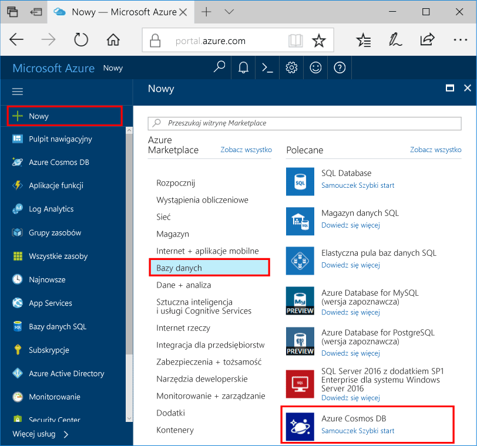

1. W nowym oknie, zaloguj się toohello [portalu Azure](https://portal.azure.com/).
2. W menu po lewej stronie powitania kliknij **nowy**, kliknij przycisk **baz danych**, a następnie w obszarze **bazy danych Azure rozwiązania Cosmos**, kliknij przycisk **Utwórz**.
   
   

3. W hello **nowe konto** bloku, określ odpowiednią konfigurację hello hello konta bazy danych Azure rozwiązania Cosmos. 

    Usługa Azure Cosmos DB umożliwia wybór jednego z czterech modeli programowania: Gremlin (graf), MongoDB, SQL (DocumentDB) oraz Tabela (klucz-wartość). 
    
    W tym szybki start firma Microsoft będzie można Programowanie w odniesieniu do hello tabeli interfejsu API, musisz wybrać **tabeli (wartość klucza)** w trakcie wypełniania hello formularza. Jeśli jednak masz dane grafu dla aplikacji mediów społecznościowych, dane dokumentu z aplikacji wykazu lub dane zmigrowane z aplikacji MongoDB, weź pod uwagę, że usługa Azure Cosmos DB może zapewnić globalnie rozproszoną platformę usługi bazy danych o wysokiej dostępności dla wszystkich Twoich aplikacji o znaczeniu krytycznym.

    Wprowadź nowy blok konta hello, korzystając z informacji hello zrzut ekranu hello jako przewodnika. Wybierzesz unikatowe wartości jako można skonfigurować konto, więc wartości nie będzie odpowiadała zrzut ekranu hello dokładnie. 
 
    

    Ustawienie|Sugerowana wartość|Opis
    ---|---|---
    ID|*Unikatowa wartość*|Unikatowa nazwa, możesz wybrać tooidentify hello Azure DB rozwiązania Cosmos konta. *Documents.Azure.com* jest dołączany toohello identyfikator Podaj toocreate Twojego identyfikatora URI, więc Użyj unikalny, ale do zidentyfikowania identyfikatora. Identyfikator Hello może zawierać tylko małe litery, cyfry i hello '-' znaków i musi zawierać od 3 do 50 znaków.
    Interfejs API|Tabela (klucz-wartość)|Firma Microsoft będzie można Programowanie w odniesieniu do hello [API tabeli](../articles/cosmos-db/table-introduction.md) dalszej części tego artykułu.|
    Subskrypcja|*Twoja subskrypcja*|Witaj mają toouse hello Azure DB rozwiązania Cosmos konta subskrypcji platformy Azure. 
    Grupa zasobów|*Witaj samą wartość jak identyfikator*|Witaj Nazwa nowej grupy zasobów dla Twojego konta. Dla uproszczenia hello takie same nazwy można użyć jako identyfikatora 
    Lokalizacja|*Witaj region najbliższy tooyour użytkowników*|Witaj lokalizację geograficzną, w których toohost konta bazy danych Azure rozwiązania Cosmos. Wybierz lokalizację hello najbliższego użytkowników tooyour toogive ich hello najszybszy dostęp do danych toohello.   

4. Kliknij przycisk **Utwórz** toocreate hello konta.
5. Na pasku narzędzi hello, kliknij przycisk **powiadomienia** procesu wdrażania hello toomonitor.

    

6.  Po zakończeniu wdrażania hello hello Otwórz nowe konto z hello wszystkie zasoby kafelka. 

    
