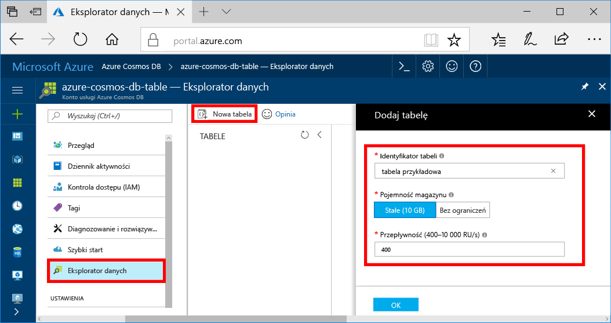

Można teraz używać toocreate Eksploratora danych tabeli i dodać tooyour danych w bazie danych. 

1. W portalu Azure, w menu nawigacji hello hello kliknij **Eksploratora danych (wersja zapoznawcza)**. 
2. W bloku Eksploratora danych hello, kliknij przycisk **nową tabelę**, a następnie wypełnij hello strony przy użyciu hello następujących informacji.

    

    Ustawienie|Sugerowana wartość|Opis
    ---|---|---
    Identyfikator tabeli|sample-table|Identyfikator Hello nowej tabeli. Nazwy tabeli mają hello wymagania sam znak jako identyfikatory bazy danych. Nazwy baz danych muszą zawierać od 1 do 255 znaków i nie mogą zawierać znaków `/ \ # ?` ani mieć spacji na końcu.
    Pojemność magazynu| 10 GB|Pozostaw wartość domyślną hello. Jest to hello pojemności hello bazy danych.
    Przepływność|400 jednostek żądania|Pozostaw wartość domyślną hello. Można skalować hello [przepływności](../articles/cosmos-db/request-units.md) później, jeżeli chcesz tooreduce opóźnienia.

3. Gdy formularz hello jest wypełniane, kliknij przycisk **OK**.
