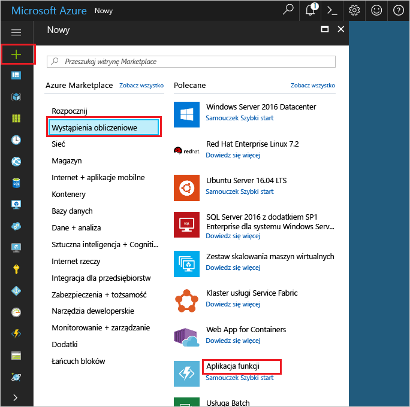

1. Kliknij przycisk **Nowy** znajdujący się w lewym górnym rogu witryny Azure Portal.Click the **New** button found on the upper left-hand corner of the Azure portal.

1. Kliknij pozycję **Obliczanie** > **Aplikacja funkcji** i wybierz swoją **subskrypcję**.Click **Compute** > **Function App**, select your **Subscription**. Następnie użyj określonych w tabeli ustawień aplikacji funkcji.Then, use the function app settings as specified in the table.

    

    | UstawienieSetting      | Sugerowana wartośćSuggested value  | OpisDescription                                        |
    | ------------ |  ------- | -------------------------------------------------- |
    | **Nazwa aplikacji****App name** | Nazwa unikatowa w skali globalnejGlobally unique name | Nazwa identyfikująca nową aplikację funkcji.Name that identifies your new function app. | 
    | **[Grupa zasobów](../articles/azure-resource-manager/resource-group-overview.md)****[Resource Group](../articles/azure-resource-manager/resource-group-overview.md)** |  myResourceGroupmyResourceGroup | Nazwa nowej grupy zasobów, w której ma zostać utworzona aplikacja funkcji.Name for the new resource group in which to create your function app. | 
    | **[Plan hostingu](../articles/azure-functions/functions-scale.md)****[Hosting plan](../articles/azure-functions/functions-scale.md)** |   Plan ZużycieConsumption plan | Plan hostingu określający sposób przydzielania zasobów do aplikacji funkcji.Hosting plan that defines how resources are allocated to your function app. W domyślnym planie (**Plan Zużycie**) zasoby są dodawane dynamicznie zgodnie z wymaganiami funkcji.In the default **Consumption Plan**, resources are added dynamically as required by your functions. Opłaty są naliczane tylko wtedy, gdy funkcje są uruchomione.You only pay for the time your functions run.   |
    | **Lokalizacja****Location** | Europa ZachodniaWest Europe | Wybierz lokalizację w swojej okolicy lub w pobliżu innych usług, do których Twoje funkcje będą uzyskiwać dostęp.Choose a location near you or near other services your functions will access. |
    | **[Konto magazynu](../articles/storage/common/storage-create-storage-account.md#create-a-storage-account)****[Storage account](../articles/storage/common/storage-create-storage-account.md#create-a-storage-account)** |  Nazwa unikatowa w skali globalnejGlobally unique name |  Nazwa nowego konta magazynu używanego przez aplikację funkcji.Name of the new storage account used by your function app. Nazwy kont usługi Magazyn muszą mieć długość od 3 do 24 znaków i mogą zawierać tylko cyfry i małe litery.Storage account names must be between 3 and 24 characters in length and may contain numbers and lowercase letters only. Możesz także użyć istniejącego konta.You can also use an existing account. |

1. Kliknij pozycję **Utwórz**, aby zainicjować obsługę nowej aplikacji funkcji i wdrożyć ją.Click **Create** to provision and deploy the new function app.