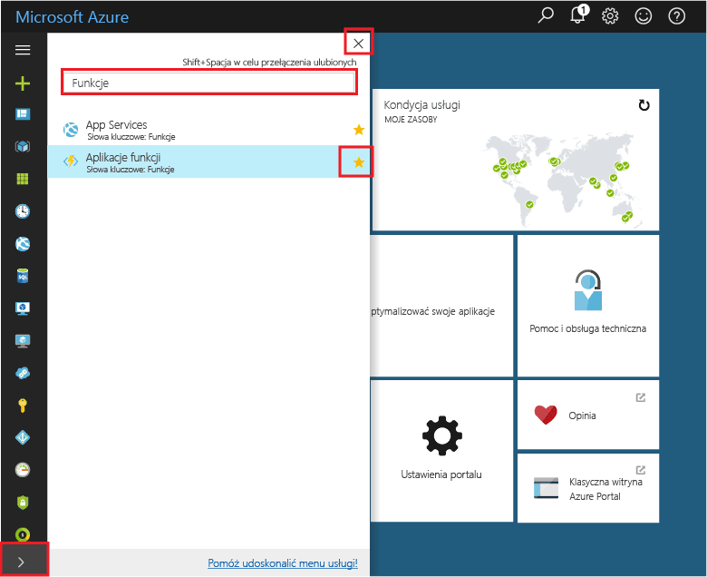
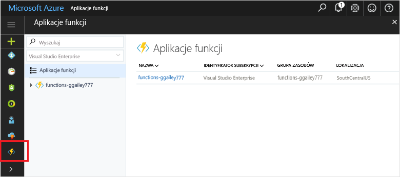

## Dodaj ulubione portalu tooyour aplikacje — funkcjaAdd Function Apps tooyour portal favorites 

Jeśli jeszcze tego nie zrobiono, dodać ulubione tooyour funkcji aplikacji hello portalu Azure.If you haven't already done so, add Function Apps tooyour favorites in hello Azure portal. Dzięki temu można łatwiej toofind funkcji aplikacji.This makes it easier toofind your function apps. Jeśli użytkownik ma już zostało to zrobione, Pomiń toohello następnej sekcji.If you have already done this, skip toohello next section. 

1. Zaloguj się za toohello [portalu Azure](https://portal.azure.com/).Log in toohello [Azure portal](https://portal.azure.com/).

2. Kliknij strzałkę hello na tooexpand lewej dolnej hello wszystkich usług, wpisz `Functions` w hello **filtru** pola, a następnie kliknij gwiazdki hello obok zbyt**aplikacji funkcji**.Click hello arrow at hello bottom left tooexpand all services, type `Functions` in hello **Filter** field, and then click hello star next too**Function Apps**.  
 
    

    Spowoduje to dodanie hello funkcje ikona toohello menu po lewej stronie powitania hello portalu.This adds hello Functions icon toohello menu on hello left of hello portal.

3. Zamknij hello menu, a następnie przewiń w dół toohello dolnej toosee hello funkcje ikony.Close hello menu, then scroll down toohello bottom toosee hello Functions icon. Kliknij ten toosee ikona listę wszystkich funkcji aplikacji.Click this icon toosee a list of all your function apps. Kliknij przycisk z funkcji toowork aplikacji z funkcjami w tej aplikacji.Click your function app toowork with functions in this app. 
 
    
 
     