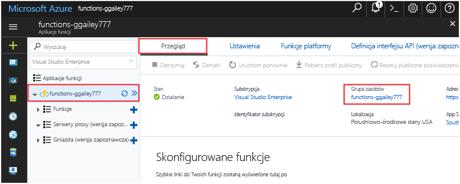

Inne przewodniki Szybki start w tej kolekcji bazują na tym przewodniku. Jeśli planujesz toocontinue toowork kolejnych Szybki Start lub hello samouczki, nie czyszczenie zasobów hello utworzone w tym szybki start. 

Jeśli nie planujesz toocontinue, kliknij przycisk hello **grupy zasobów** dla aplikacji funkcja hello hello portalu, a następnie kliknij polecenie **usunąć**. 

