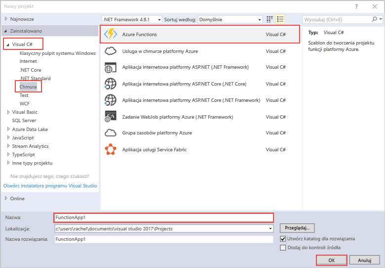

szablon projektu usługi Azure Functions Hello w programie Visual Studio tworzy projekt, który może być opublikowane tooa funkcji aplikacji na platformie Azure. Aplikacja funkcji umożliwia grupowanie funkcji jako jednostki logicznej, co ułatwia wdrażanie i udostępnianie zasobów oraz zarządzanie nimi.   

1. Kliknij prawym przyciskiem myszy węzeł projektu hello w **Eksploratora rozwiązań**, a następnie wybierz **Dodaj** > **nowy element**. Wybierz **funkcji platformy Azure** powitalne okno dialogowe.

2. W hello **nowy projekt** okna dialogowego, rozwiń węzeł **Visual C#** > **chmury** węzła, wybierz opcję **usługi Azure Functions**, wpisz **Nazwa** Twojego projektu, a następnie kliknij przycisk **OK**. Nazwa aplikacji Hello funkcja musi być prawidłowy C# przestrzeni nazw, dlatego nie należy używać znaków podkreślenia, łączniki lub innych znaków innych niż alfanumeryczne. 

    
