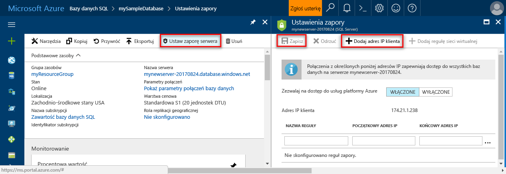

<!--
includes/sql-database-create-new-server-firewall-portal.md

Latest Freshness check:  2016-11-28 , rickbyh.

As of circa 2016-04-11, hello following topics might include this include:
articles/sql-database/sql-database-get-started.md
articles/sql-database/sql-database-configure-firewall-settings
articles/sql-data-warehouse-get-started-provision.md

-->
### Utworzyć regułę zapory poziomu serwera w hello portalu AzureCreate a server-level firewall rule in hello Azure portal

1. W bloku serwera SQL hello, w obszarze Ustawienia, kliknij polecenie **zapory** tooopen hello zapory bloku dla hello programu SQL server.On hello SQL server blade, under Settings, click **Firewall** tooopen hello Firewall blade for hello SQL server.

    <!--  -->

2. Przejrzyj wyświetlony adres IP powitania klienta i sprawdzić, czy jest to adres IP na powitania Internet za pomocą przeglądarki wybranych przez użytkownika (zapytaj "co to jest adresu IP).Review hello client IP address displayed and validate that this is your IP address on hello Internet using a browser of your choice (ask "what is my IP address). Czasami te adresy nie zgadzają się z różnych powodów.Occasionally they do not match for a various reasons.

    <!--  -->

3. Przy założeniu, że adresy IP hello zgodne, kliknij przycisk **Dodaj adres IP klienta** na powitania narzędzi.Assuming that hello IP addresses match, click **Add client IP** on hello toolbar.

    

    > [!NOTE]
    > Można otworzyć zapory bazy danych SQL hello na powitania tooa pojedynczy adres IP serwera lub całego zakresu adresów.You can open hello SQL Database firewall on hello server tooa single IP address or an entire range of addresses. Otwieranie hello zapory umożliwia administratorom SQL i bazy danych tooany toologin użytkowników na hello toowhich serwera mają prawidłowe poświadczenia.Opening hello firewall enables SQL administrators and users toologin tooany database on hello server toowhich they have valid credentials.
    >

4. Kliknij przycisk **zapisać** na hello toosave narzędzi tę regułę zapory poziomu serwera, a następnie kliknij przycisk **OK**.Click **Save** on hello toolbar toosave this server-level firewall rule and then click **OK**.

    

> [!Tip]
> Aby zapoznać się z samouczkiem, zobacz artykuł [Samouczek usługi SQL Database: tworzenie serwera, reguły zapory na poziomie serwera, przykładowej bazy danych i reguły zapory na poziomie bazy danych oraz nawiązywanie połączenia z programem SQL Server](../articles/sql-database/sql-database-get-started.md).For a tutorial, see [SQL Database tutorial: Create a server, a server-level firewall rule, a sample database, a database-level firewall rule and connect with SQL Server](../articles/sql-database/sql-database-get-started.md).    
>
