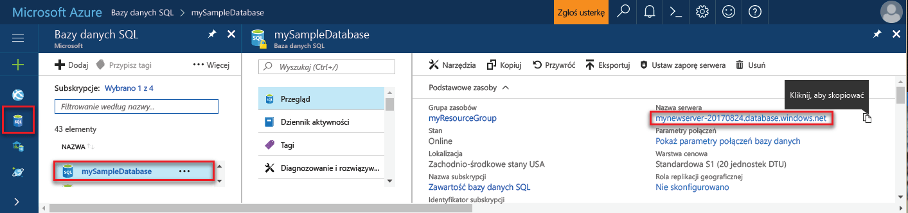

## Zaloguj się za toohello portalu AzureLog in toohello Azure portal

Zaloguj się za toohello [portalu Azure](https://portal.azure.com/).Log in toohello [Azure portal](https://portal.azure.com/).

## Utwórz pustą bazę danych SQL przy użyciu hello portalu AzureCreate a blank SQL database using hello Azure portal

Baza danych Azure SQL jest tworzona ze zdefiniowanym zestawem [zasobów obliczeniowych i przechowywania](../articles/sql-database/sql-database-service-tiers.md).An Azure SQL database is created with a defined set of [compute and storage resources](../articles/sql-database/sql-database-service-tiers.md). Witaj baza danych została utworzona w ramach [grupy zasobów platformy Azure](../articles/azure-resource-manager/resource-group-overview.md) i [serwera logicznego bazy danych SQL Azure](../articles/sql-database/sql-database-features.md).hello database is created within an [Azure resource group](../articles/azure-resource-manager/resource-group-overview.md) and in an [Azure SQL Database logical server](../articles/sql-database/sql-database-features.md). 

Wykonaj te kroki toocreate pustej bazy danych SQL.Follow these steps toocreate a blank SQL database. 

1. Kliknij przycisk hello **nowy** znaleziono przycisku na powitania lewym górnym rogu hello portalu Azure.Click hello **New** button found on hello upper left-hand corner of hello Azure portal.

2. Wybierz **baz danych** z hello **nowy** i wybrać opcję **bazy danych SQL** z hello **baz danych** strony.Select **Databases** from hello **New** page, and select **SQL Database** from hello **Databases** page. 

   

3. Wypełnianie hello bazy danych SQL formularza z hello następujących informacji, jak pokazano na powitania poprzedzających obrazu:Fill out hello SQL Database form with hello following information, as shown on hello preceding image:   

   | UstawienieSetting | Sugerowana wartośćSuggested value | OpisDescription |
   | --------| --------------- | ----------- | 
   | **Nazwa bazy danych****Database name** | mySampleDatabasemySampleDatabase | Prawidłowe nazwy baz danych opisano w artykule [Database Identifiers](https://docs.microsoft.com/sql/relational-databases/databases/database-identifiers) (Identyfikatory baz danych).For valid database names, see [Database Identifiers](https://docs.microsoft.com/sql/relational-databases/databases/database-identifiers). | 
   | **Subskrypcja****Subscription** | Twoja subskrypcjaYour subscription  | Aby uzyskać szczegółowe informacje o subskrypcjach, zobacz [Subskrypcje](https://account.windowsazure.com/Subscriptions).For details about your subscriptions, see [Subscriptions](https://account.windowsazure.com/Subscriptions). |
   | **Grupa zasobów****Resource group** | myResourceGroupmyResourceGroup | Prawidłowe nazwy grup zasobów opisano w artykule [Naming rules and restrictions](https://docs.microsoft.com/azure/architecture/best-practices/naming-conventions) (Reguły i ograniczenia nazewnictwa).For valid resource group names, see [Naming rules and restrictions](https://docs.microsoft.com/azure/architecture/best-practices/naming-conventions). |
   | **Wybierz źródło****Select source** | Pusta baza danychBlank database | Określa, czy można utworzyć pustej bazy danych.Specifies that a blank database should be created. |
   ||||

4. Kliknij przycisk **serwera** toocreate i skonfiguruj nowy serwer dla nowej bazy danych.Click **Server** toocreate and configure a new server for your new database. Wypełnianie hello **nowy formularz serwera** z hello następujących informacji:Fill out hello **New server form** with hello following information: 

   | UstawienieSetting | Sugerowana wartośćSuggested value | OpisDescription |
   | --------| --------------- | ----------- | 
   | **Nazwa serwera****Server name** | Wszelkie globalnie unikatowej nazwy.Any globally unique name. | Prawidłowe nazwy serwera opisano w artykule [Naming rules and restrictions](https://docs.microsoft.com/azure/architecture/best-practices/naming-conventions) (Reguły i ograniczenia nazewnictwa).For valid server names, see [Naming rules and restrictions](https://docs.microsoft.com/azure/architecture/best-practices/naming-conventions). | 
   | **Identyfikator logowania administratora serwera****Server admin login** | Wszelkie prawidłową nazwę.Any valid name. | Prawidłowe nazwy identyfikatorów logowania opisano w artykule [Database Identifiers](https://docs.microsoft.com/sql/relational-databases/databases/database-identifiers) (Identyfikatory baz danych).For valid login names, see [Database Identifiers](https://docs.microsoft.com/sql/relational-databases/databases/database-identifiers).|
   | **Hasło****Password** | Wszystkie prawidłowe hasło.Any valid password. | Hasło musi mieć co najmniej ośmiu znaków i musi zawierać znaki z trzech z następujących kategorii hello: wielkich liter, małych liter, cyfr i znaków innych niż alfanumeryczne.Your password must have at least eight characters and must contain characters from three of hello following categories: upper case characters, lower case characters, numbers, and non-alphanumeric characters. |
   | **Lokalizacja****Location** | Żadnej prawidłowej lokalizacji.Any valid location. | Aby uzyskać informacje na temat regionów, zobacz temat [Regiony systemu Azure](https://azure.microsoft.com/regions/).For information about regions, see [Azure Regions](https://azure.microsoft.com/regions/). |
   ||||

   

5. Kliknij pozycję **Wybierz**.Click **Select**.

6. Kliknij przycisk **warstwa cenowa** toospecify hello warstwę i poziom wydajności usługi dla nowej bazy danych.Click **Pricing tier** toospecify hello service tier and performance level for your new database. W tym samouczku, wybierz **20 jednostek Dtu** i **250** GB miejsca do magazynowania.For this tutorial, select **20 DTUs** and **250** GB of storage.

   

7. Kliknij przycisk **Zastosuj**.Click **Apply**.  

8. Wybierz **sortowania** dla hello pustej bazy danych (w tym samouczku, wartość domyślna używana hello).Select a **collation** for hello blank database (for this tutorial, use hello default value). Aby uzyskać więcej informacji na temat sortowań zobacz [sortowania](https://docs.microsoft.com/sql/t-sql/statements/collations)For more information about collations, see [Collations](https://docs.microsoft.com/sql/t-sql/statements/collations)

9. Kliknij przycisk **Utwórz** tooprovision hello w bazie danych.Click **Create** tooprovision hello database. Inicjowanie obsługi administracyjnej ma o toocomplete minutę i pół.Provisioning takes about a minute and a half toocomplete. 

10. Na pasku narzędzi hello, kliknij przycisk **powiadomienia** procesu wdrażania hello toomonitor.On hello toolbar, click **Notifications** toomonitor hello deployment process.

   

## Utworzyć regułę zapory poziomu serwera przy użyciu hello portalu AzureCreate a server-level firewall rule using hello Azure portal

Witaj usługi baza danych SQL tworzy zapory na poziomie serwera hello.hello SQL Database service creates a firewall at hello server-level. Początkowo hello Zapora uniemożliwia zewnętrznych narzędzi i aplikacji łączących toohello serwera lub bazy danych tooany na powitania serwera.Initially hello firewall prevents external tools and applications from connecting toohello server, or tooany databases on hello server. Połączenia są dozwolone po utworzeniu reguły zapory tooopen określonych adresów IP.Connections are allowed after a firewall rule is created tooopen specific IP addresses. Wykonaj te kroki toocreate [regułę zapory poziomu serwera bazy danych SQL](../articles/sql-database/sql-database-firewall-configure.md) adresów IP klienta i tooenable łączność zewnętrzną przez zaporę bazy danych SQL hello tylko adresu IP.Follow these steps toocreate a [SQL Database server-level firewall rule](../articles/sql-database/sql-database-firewall-configure.md) for your client's IP address, and tooenable external connectivity through hello SQL Database firewall for your IP address only. 

> [!NOTE]
> Baza danych SQL Azure komunikuje się za pośrednictwem portu 1433.Azure SQL Database communicates over port 1433. Możesz połączyć tooSQL bazy danych tylko wtedy, gdy Zapora hello sieci zezwala na ruch wychodzący przez port 1433.You can connect tooSQL Database only after hello firewall of your network allows outbound traffic through port 1433.

1. Po zakończeniu wdrażania hello, kliknij przycisk **baz danych SQL** z menu po lewej stronie powitania, a następnie kliknij przycisk **mySampleDatabase** na powitania **baz danych SQL** strony.After hello deployment completes, click **SQL databases** from hello left-hand menu and then click **mySampleDatabase** on hello **SQL databases** page. Witaj strona przeglądu otwartym bazy danych przedstawiający hello w pełni kwalifikowana nazwa serwera (takich jak **mynewserver20170313.database.windows.net**) i udostępnia opcje dla dalszej konfiguracji.hello overview page for your database opens, showing you hello fully qualified server name (such as **mynewserver20170313.database.windows.net**) and provides options for further configuration. Skopiuj tę w pełni kwalifikowaną nazwę serwera do użycia w przyszłości.Copy this fully qualified server name for use later.

   > [!IMPORTANT]
   > Należy to pełna nazwa tooconnect tooyour serwera i jego baz danych w kolejnych Szybki Start.You need this fully qualified server name tooconnect tooyour server and its databases in subsequent quick starts.
   > 

    

2. Kliknij przycisk **ustawić Zapora serwera** na powitania narzędzi, jak pokazano na poprzedniej ilustracji hello.Click **Set server firewall** on hello toolbar as shown in hello previous image. Witaj **ustawienia zapory** zostanie otwarta strona hello bazy danych SQL Server.hello **Firewall settings** page for hello SQL Database server opens. 

    

3. Kliknij przycisk **Dodaj adres IP klienta** na powitania narzędzi tooadd IP bieżący adres tooa nowej reguły zapory.Click **Add client IP** on hello toolbar tooadd your current IP address tooa new firewall rule. Reguła zapory może otworzyć port 1433 dla pojedynczego adresu IP lub zakresu adresów IP.A firewall rule can open port 1433 for a single IP address or a range of IP addresses.

4. Kliknij pozycję **Zapisz**.Click **Save**. Dla bieżącego adresu IP otwierania portu 1433 na serwerze logicznym hello tworzona jest reguła zapory poziomu serwera.A server-level firewall rule is created for your current IP address opening port 1433 on hello logical server.

    

4. Kliknij przycisk **OK** , a następnie zamknij hello **ustawienia zapory** strony.Click **OK** and then close hello **Firewall settings** page.

Teraz można podłączyć toohello serwera bazy danych SQL Azure i jej baz danych za pomocą narzędzi takich jak SQL Server Management Studio (SSMS).You can now connect toohello Azure SQL Database server and its databases by using a tool such as SQL Server Management Studio (SSMS). połączenie Hello jest z tego adresu IP i używa konta administratora serwera na powitania utworzone wcześniej.hello connection is from this IP address, and it uses hello server admin account created previously.

> [!IMPORTANT]
> Domyślnie dostęp za pośrednictwem zapory bazy danych SQL hello jest włączona dla wszystkich usług platformy Azure.By default, access through hello SQL Database firewall is enabled for all Azure services. Kliknij przycisk **OFF** na toodisable tej strony dla wszystkich usług platformy Azure.Click **OFF** on this page toodisable for all Azure services.

## Pobierz wartości parametrów połączeń przy użyciu hello portalu AzureGet connection string values using hello Azure portal

Pobierz hello pełni kwalifikowaną nazwę serwera dla serwera bazy danych SQL Azure w hello portalu Azure.Get hello fully qualified server name for your Azure SQL Database server in hello Azure portal. Możesz użyć hello pełną nazwę tooconnect tooyour serwera przy użyciu programu SQL Server Management Studio.You use hello fully qualified server name tooconnect tooyour server using SQL Server Management Studio.

1. Zaloguj się za toohello [portalu Azure](https://portal.azure.com/).Log in toohello [Azure portal](https://portal.azure.com/).

2. Wybierz **baz danych SQL** z menu po lewej stronie powitania i kliknij bazę danych na powitania **baz danych SQL** strony.Select **SQL Databases** from hello left-hand menu, and click your database on hello **SQL databases** page. 

3. W hello **Essentials** okienka w hello strony portalu systemu Azure dla bazy danych, Znajdź, a następnie skopiuj hello **nazwy serwera**.In hello **Essentials** pane in hello Azure portal page for your database, locate and then copy hello **Server name**.

    
